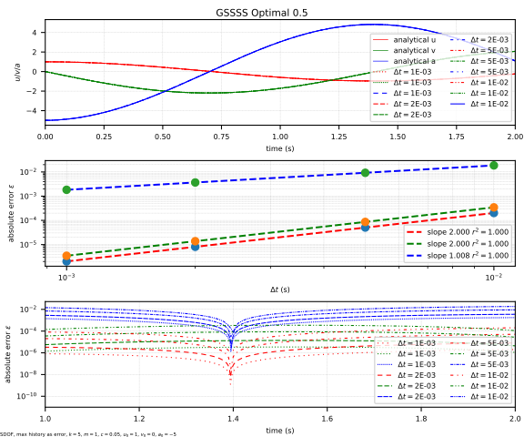

# GSSSS

The Generalized Single Step Single Solve Unified Framework

The GSSSS approach unifies various time integration methods in a single framework.

## References

1. [Advances in Computational Dynamics of Particles, Materials and Structures](https://www.wiley.com/en-us/Advances+in+Computational+Dynamics+of+Particles%2C+Materials+and+Structures-p-9780470749807)
2. [10.1002/nme.89](https://doi.org/10.1002/nme.89)
3. [10.1002/nme.873](https://doi.org/10.1002/nme.873)

There are quite a few papers on this topic by the same group of authors. Similar contents can be found in a number of
papers. The implementation is based on a unified predictor multi-corrector representation. It is sufficiently general so
that both elastic and elastoplastic systems can be analyzed. The implementation is documented in details in Section
14.3.4 (Eqs. 14.280 --- 14.296) of the first reference.

It is strongly recommended to give the references a careful read as GSSSS is very elegant if you wish to learn more
about the advances in computational dynamics.

## Syntax

Both U0 and V0 families are available.

```
integrator GSSSSU0 (1) (2) (3) (4)
integrator GSSSSV0 (1) (2) (3) (4)
# (1) int, unique integrator tag
# (2) double, spectral radius (order does not matter)
# (3) double, spectral radius (order does not matter)
# (4) double, spectral radius (order does not matter)
```

The optimal scheme (see table below) only requires one spectral radius, one can use the following command to use the 
optimal scheme.

```text
integrator GSSSSOptimal (1) [2]
# (1) int, unique integrator tag
# [2] double, spectral radius, default: 0.5
```

## Remarks

The framework has three parameters to be defined, namely $$\rho_{1,\infty}$$, $$\rho_{2,\infty}$$ and $$\rho_
{3,\infty}$$. They satisfy the following condition,

$$
0\leqslant\rho_{3,\infty}\leqslant\rho_{1,\infty}\leqslant\rho_{2,\infty}\leqslant1.
$$

The syntax takes three spectral radii in arbitrary order, they are clamped between zero and unity, sorted and assigned
to $$\rho_{3,\infty}$$, $$\rho_{1,\infty}$$ and $$\rho_{2,\infty}$$ to compute internal parameters. Users can thus
assign three valid radii without worrying about the order.

A number of commonly known methods can be accommodated in the framework. For example:

| Method            | Family | Value $$\rho_{1,\infty}$$ | Value $$\rho_{2,\infty}$$ | Value $$\rho_{3,\infty}$$ |
|-------------------|--------|---------------------------|---------------------------|---------------------------|
| Newmark           | U0     | $$1$$                     | $$1$$                     | $$0$$                     |
| Classic Midpoint  | U0/V0  | $$1$$                     | $$1$$                     | $$1$$                     |
| Generalised Alpha | U0     | $$\rho$$                  | $$\rho$$                  | $$\rho$$                  |
| WBZ               | U0     | $$\rho$$                  | $$\rho$$                  | $$0$$                     |
| HHT               | U0     | $$\rho$$                  | $$\rho$$                  | $$\dfrac{1-\rho}{2\rho}$$ |
| **U0-V0 Optimal** | U0/V0  | $$\rho$$                  | $$1$$                     | $$\rho$$                  |
| New Midpoint      | V0     | $$1$$                     | $$1$$                     | $$0$$                     |

## Accuracy Analysis




