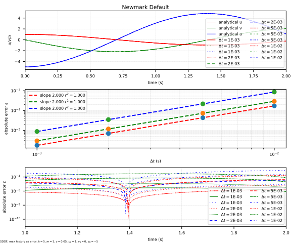
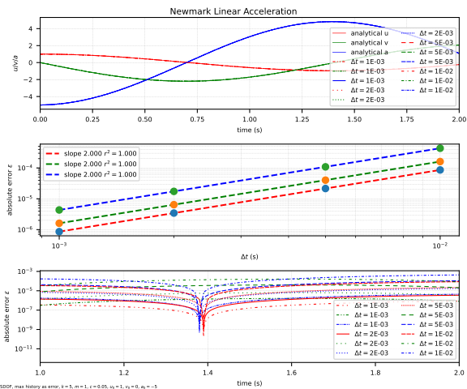

# Newmark

Newmark Time Integration

## Syntax

```
integrator Newmark (1) [2] [3]
# (1) int, unique tag
# [2] double, alpha, default: 0.25
# [3] double, beta, default: 0.5
```

## Governing Equation

The displacement and velocity are integrated as

$$
d_{n+1}=d_n+\Delta{}tv_n+\Delta{}t^2\left(\left(\dfrac{1}{2}-\alpha\right)a_n+\alpha{}a_{n+1}\right),
$$

$$
v_{n+1}=v_n+\Delta{}t\left(1-\beta\right)a_n+\Delta{}t\beta{}a_{n+1}.
$$

The equation of motion is expressed at $$t_{n+1}$$.

$$
Ma_{n+1}+Cv_{n+1}+Kd_{n+1}=F_{n+1}.
$$

## Accuracy Analysis



