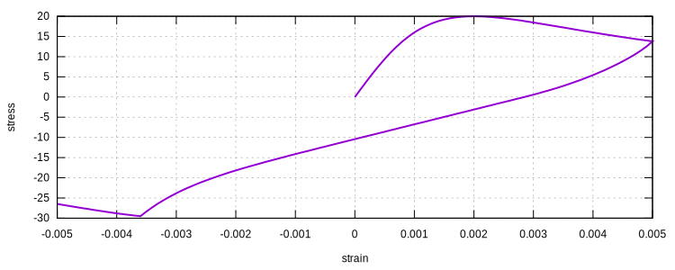
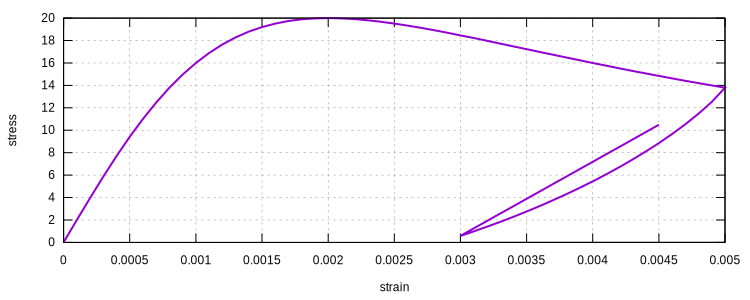
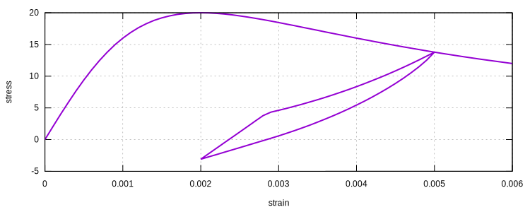
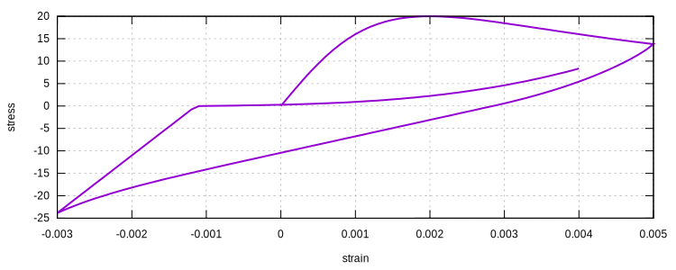
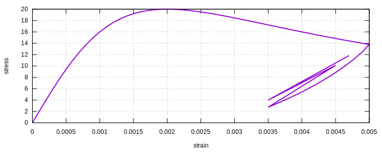
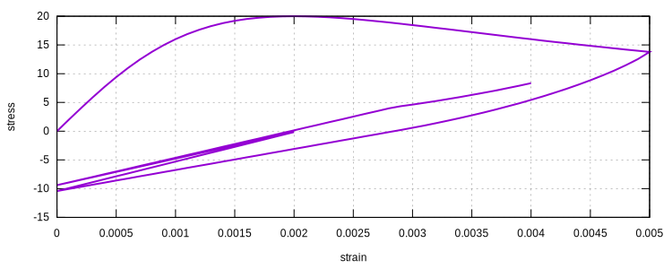

# ConcreteCM

Chang-Mander Concrete Model

## Syntax

```
material ConcreteCM (1) (2) (3) (4) (5) (6) [7] [8] [9] [10]
# (1) int, unique material tag
# (2) double, elastic modulus
# (3) double, compression strength, should be negative but sign insensitive
# (4) double, tension strength, should be positive but sign insensitive
# (5) double, NC
# (6) double, NT
# [7] double, strain at compression strength, default: -2E-3
# [8] double, strain at tension strength, default: 1E-4
# [9] bool string, linear transition switch, default: false
# [10] double, density, default: 0.0
```

## Remarks

1. The Chang-Mander concrete model use Tsai's equation as backbone curves for both tension and compression.
2. Parameters `NC` and `NT` control the shapes of backbone curves. Detailed explanation is presented later.
3. In the original model, the transition between compression and tension could sometimes have larger stiffness than
   initial stiffness. This is unlikely to be true in reality.
4. A linear behaviour of part of hysteresis behaviour can be applied by turning on the linear transition switch. ***It
   shall be noted that a linear hysteresis rule is much more stable than the original version.***
5. The original CM model has some undefined behaviour which may cause stability issues. This is a simplified model.

## History Variable Layout

| location              | value                |
|-----------------------|----------------------|
| `initial_history(0)`  | unload_c_strain      |
| `initial_history(1)`  | unload_c_stress      |
| `initial_history(2)`  | reverse_c_strain     |
| `initial_history(3)`  | reverse_c_stress     |
| `initial_history(4)`  | residual_c_strain    |
| `initial_history(5)`  | residual_c_stiffness |
| `initial_history(6)`  | unload_t_strain      |
| `initial_history(7)`  | unload_t_stress      |
| `initial_history(8)`  | reverse_t_strain     |
| `initial_history(9)`  | reverse_t_stress     |
| `initial_history(10)` | residual_t_strain    |
| `initial_history(11)` | residual_t_stiffness |
| `initial_history(12)` | connect_c_stress     |
| `initial_history(13)` | connect_c_stiffness  |
| `initial_history(14)` | connect_t_stress     |
| `initial_history(15)` | connect_t_stiffness  |
| `initial_history(16)` | inter_strain         |
| `initial_history(17)` | inter_stress         |
| `initial_history(18)` | reload_c_stiffness   |
| `initial_history(19)` | reload_t_stiffness   |

## General Description of the Model

### Unload from backbone



### Reload from unload branch

#### Reload before residual



#### Reload between two residuals



#### Reload after the opposite residual



#### Small Cycle





## Determination of Parameters

The Tsai's equation (Tsai, 1988) can be expressed as

$$
y=\dfrac{mx}{1+(m-\dfrac{n}{n-1})x+\dfrac{x^n}{n-1}}.
$$

where $$x=\varepsilon/\varepsilon_c$$ or $$x=\varepsilon/\varepsilon_t$$ is normalized strain and $$y=f/f_c$$ and
$$y=f/f_t$$ are normalized stress. The stress decreases to zero if $$m(n-1)>n$$ and $$n>1$$. The initial stiffness is
related to $$m_t$$ and $$m_c$$ by

$$
E_0=mE_s=m_t\dfrac{f_t}{\varepsilon_t}=m_c\dfrac{f_c}{\varepsilon_c}.
$$

Once $$E_0$$ is given, $$m_c$$ and $$m_t$$ are determined automatically.

The parameter $$n$$ controls the slope of descending branch, normally $$n_t>n_c$$. Some empirical expressions are
available to determine both $$m$$ and $$n$$. But most are unit dependent. Users shall do manual conversion. For example,

$$
m_c=1+\dfrac{17.9}{f_c}\quad{}f_c\text{ in MPa},
$$

$$
m_c=1+\dfrac{2600}{f_c}\quad{}f_c\text{ in psi},
$$

$$
n_c=\dfrac{f_c}{6.68}-1.85>1\quad{}f_c\text{ in MPa},
$$

$$
n_c=\dfrac{f_c}{970}-1.85>1\quad{}f_c\text{ in psi}.
$$
