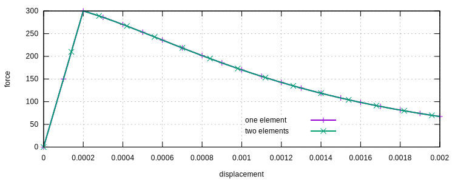

# ConcreteExp

Objective Concrete Model

The `ConcreteExp` model uses the exponential functions from the Barcelona model (Lubliner, 1989) as the backbones. The
main advantage is now the area under the backbone has an upper bound and can be explicitly integrated. By associating
this value with objective quantities, it is possible to obtain a uni-axial concrete model that supports objective
response.

## Syntax

```
material ConcreteExp (1) (2) (3) (4) (5) (6) (7) (8) [9] [10]
# (1) int, unique tag
# (2) double, elastic modulus
# (3) double, f_t
# (4) double, a_t
# (5) double, g_t
# (6) double, f_{c,m}
# (7) double, a_c
# (8) double, g_c
# [9] double, middle point, default: 0.2
# [10] double, density, default: 0.0
```

## History Variable Layout

Since it is derived from the [`SimpleHysteresis`](../Hysteresis/SimpleHysteresis.md) model, they share the same history
variable layout.

## Theory

For both tension and compression, the following equation is used for the backbone.

$$
\dfrac{\sigma}{f}=\left(1+a\right)\exp\left(-b\varepsilon_p\right)-a\exp\left(-2b\varepsilon_p\right)
$$

where $$a$$ and $$b$$ are two material properties that control the shape of the backbone. For tension, $$a<1$$. For
compression $$a>1$$.

The area under the backbone is

$$
g=\dfrac{a+2}{2b}f.
$$

So for a fixed $$g$$, $$b$$ can be computed as

$$
b=\dfrac{a+2}{2g}f.
$$

The model accepts $$g_t$$ and $$g_c$$ in order to obtain objective results.

The parameters $$f_t$$ and $$f_c$$ are elastic limits of tension and compression respectively. **However, the maximum
strength $$f_{c,m}$$ are taken as inputs since for compression there is a hardening response.**

It could be derived that

$$
\dfrac{f_c}{f_{c,m}}=\dfrac{4a_c}{\left(1+a_c\right)^2}.
$$

If, as normally assumed, the elastic limit of $$80~\%$$ of the maximum strength, then

$$
\dfrac{f_c}{f_{c,m}}=\dfrac{4a_c}{\left(1+a_c\right)^2}=0.8,\qquad a_c\approx3.73.
$$

For other ratios, $$a_c$$ can be determined accordingly.

## Determination of Parameters

The parameter $$g_t$$ could be associated with the mode one specific fracture energy of the material. For concrete, it
typically ranges from $$40~\mathrm{N/m}$$ to $$120~\mathrm{N/m}$$ (according to ABAQUS). Values of similar scale can be
used.

The counterpart $$g_c$$ can be chosen as several hundred times larger than $$g_t$$.

The $$a_t$$ can be set to $$(0,~1)$$, typically, a value of $$0.7$$ is good for general use. The $$a_c$$ is greater than
$$1$$. A larger $$a_c$$ has a narrower hardening region and thus degrades more rapidly. For high strength concrete,
$$a_c$$ can be large. For low strength concrete, $$a_c$$ could be around $$2$$.

```
material ConcreteExp 1 3E4 3. .6 4E-3 30. 4. 1E-1 .2
```

The above command has the following tension response (strain and stress).


And the following compression response.


## Example

First we shall how to obtain objective results.

Consider the uniaxial tension/compression of a prismatic bar of unit length, it can be modelled by the truss element (
T2D2). With one element defined, the material model can be defined as follows.

```
material ConcreteExp 1 3E4 3. .6 4E-3 30. 4. 1E-1 .2
```

Then define two elements to model the bar. Since the characteristic length is halved, $$g_t$$ and $$g_c$$ shall be
doubled.

```
material ConcreteExp 2 3E4 3. .6 2E-3 30. 4. 5E-2 .2
```

Easy to see that the response is fully objective.



The full script of the model is listed.

```
node 1 0 0
node 2 1 0
node 3 2 0

material ConcreteExp 1 3E4 3. .6 4E-3 30. 4. 1E-1 .2
material ConcreteExp 2 3E4 3. .6 2E-3 30. 4. 5E-2 .2

# two elements
# element T2D2 1 1 2 1 100
# element T2D2 2 2 3 1 100

# one element
# element T2D2 1 1 3 2 100

fix 1 1 1
fix 2 2 1 2 3

hdf5recorder 1 Node RF1 3
hdf5recorder 2 Node U1 3

step static 1
set ini_step_size 1E-2
set fixed_step_size 1

displacement 1 0 2E-3 1 3

converger AbsIncreDisp 1 1E-8 10 1

analyze

save recorder 1 2

exit
```
