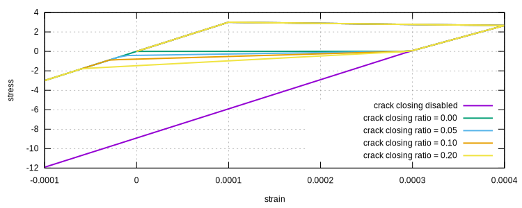
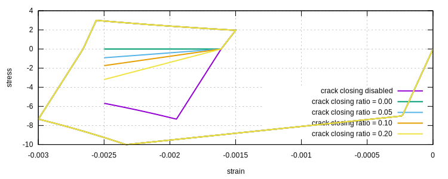
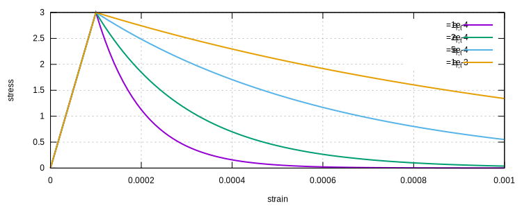
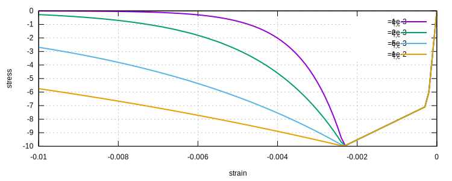
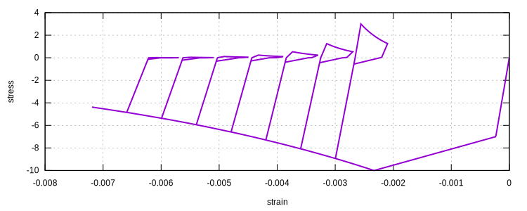

# ConcreteK4

A Uniaxial Plastic-Damage Concrete Model

## Reference

1. [10.1061/(ASCE)ST.1943-541X.0002592](https://doi.org/10.1061/(ASCE)ST.1943-541X.0002592)
2. [Constitutive Modelling Cookbook](https://github.com/TLCFEM/constitutive-modelling-cookbook/releases/download/latest/COOKBOOK.pdf)

## Syntax

```
material ConcreteK4 (1) (2) (3) (4) (5) (6) (7) (8) (9) (10) (11) [12]
# (1) int, unique material tag
# (2) double, elastic modulus (+), typical: 30000 (in MPa)
# (3) double, crack closing stiffness ratio (+), typical: ~0.1
# (4) double, tensile hardening ratio (+), typical: [0,1]
# (5) double, compressive hardening ratio (+), typical: [0,1]
# (6) double, tensile strength (+), typical: 3 (in MPa)
# (7) double, crush (compressive) strength (+), typical: 40 (in MPa)
# (8) double, crush (compressive) strain (+), typical: 0.002
# (9) double, yield (compressive) strength ratio (<1), typical: ~0.7
# (10) double, reference tensile zeta
# (11) double, reference compressive zeta
# [12] double, density, default: 0.0
```

## Theory

There is no official name proposed by the authors.
The name K4 comes from the fact that the four authors' last names all start with the letter K.

The model implements the proposed hardening laws and crack closing mechanism.
But the damage evolution is different from the original formulation.
In specific, the original linear damage evolution is replaced by an exponential law that would alleviate potential
numerical issues, as the numerical world does not like exact zeros.

### Additive Split

$$
\sigma=\left(1-d\right)\bar{\sigma}.
$$

### Yield Function

$$
F=\left\{
\begin{array}{ll}
F_t,&\bar{\sigma}>0,\\
F_c,&\text{otherwise},
\end{array}
\right.
$$

with

$$
F_t=\bar{\sigma}-\bar{\sigma}_{y,t},\qquad
F_c=-\bar{\sigma}-\bar{\sigma}_{y,c}.
$$

### Flow Rule

$$
\dot{\varepsilon^p}=\gamma~\text{sign}{\bar{\sigma}}.
$$

### Hardening Laws

$$
\bar{\sigma}_{y,t}=f_t+h_tk_t,\qquad
\bar{\sigma}_{y,c}=\left\{
\begin{array}{ll}
f_y+h_ck_c,&k_c\leqslant{}k_0,\\
f_y+h_ck_0+h_d\left(k_c-k_0\right),&\text{otherwise}.
\end{array}
\right.
$$

The tensile strength $$f_t$$ is controlled by `(6)`.
The hardening modulus $$h_t$$ is computed as `(4)` times elastic modulus.

The crush strength $$f_c$$ `(7)` can be expressed as $$f_c=f_y+h_ck_0$$ where $$f_y$$ is `(9)` times $$f_c$$.
$$k_0$$ is strain when crush strength is reached, this is controlled by `(8)`.
The hardening modulus $$h_c$$ is automatically computed.
The hardening modulus $$h_d$$ is computed as `(5)` times elastic modulus.

### Damage

$$
d_t=1-\exp\left(-\dfrac{k_t}{e_{r,t}}\right),\qquad
d_c=1-\exp\left(-\dfrac{k_c}{e_{r,c}}\right).
$$

The reference strain $$e_{r,t}$$ and $$e_{r,c}$$ are used to control the damage evolution.
They can be expressed as

$$
e_{r,t}=\zeta_t\dfrac{f_t}{h_t},\qquad
e_{r,c}=\zeta_c\dfrac{f_c}{h_d},
$$

in which $$\zeta_t$$ and $$\zeta_c$$ are `(10)` and `(11)` respectively.


## Examples

### Effect of Crack Closing Stiffness Ratio

The crack closing stiffness ratio `(3)` controls the slope of the segment where crack opening is gradually closed.





### Effect of Tensile Reference Strain

Basic model:

```text
material ConcreteK4 1 3E4 .05 .01 .01 3. 10. 2E-3 .7 1E-2 3E-2
```



### Effect of Compressive Reference Strain

Basic model:

```text
material ConcreteK4 1 3E4 .05 .01 .01 3. 10. 2E-3 .7 1E-2 3E-2
```



### A Cyclic Example

```text
material ConcreteK4 1 3E4 .05 .01 .01 3. 10. 2E-3 .7 5E-2 15E-2

materialTest1D 1 -1E-5 300 90 150 90 150 90 150 90 150 90 150 90 150 90 150
```


