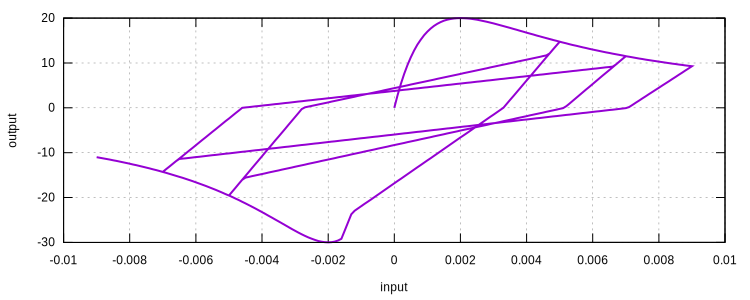
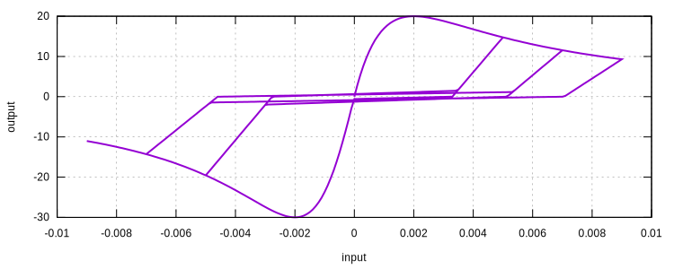

# ConcreteTsai

Uniaxial Concrete Model Using Tsai's Equation

The `ConcreteTsai` model is a simple concrete model using Tsai's equation.

## Syntax

```
material ConcreteTsai (1) (2) (3) (4) (5) (6) (7) (8) (9) [10]
# (1) int, unique material tag
# (2) double, elastic modulus
# (3) double, compression strength, should be negative but sign insensitive
# (4) double, tension strength, should be positive but sign insensitive
# (5) double, NC
# (6) double, NT
# (7) double, middle point, typical: 0.2
# (8) double, strain at compression strength, typical: -2E-3
# (9) double, strain at tension strength, typical: 1E-4
# [10] double, density, default: 0.0
```

## History Variable Layout

Since it is derived from the [`SimpleHysteresis`](../Hysteresis/SimpleHysteresis.md) model, they share the same history
variable layout.

## Remarks

1. The middle point parameter represents the size of hysteresis loop, valid values range from 0 to 1 (ends not
   recommended).
2. There is no additional consideration for small loops, which is available in [`ConcreteCM`](ConcreteCM.md).

## Usage

```
material ConcreteTsai 1 3E4 30 20 2 2 .8 2E-3 2E-3
materialTest1D 1 1E-4 50 100 120 140 160 180
exit
```



```
material ConcreteTsai 1 3E4 30 20 2 2 .1 2E-3 2E-3
materialTest1D 1 1E-4 50 100 120 140 160 180
exit
```


