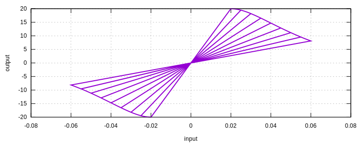
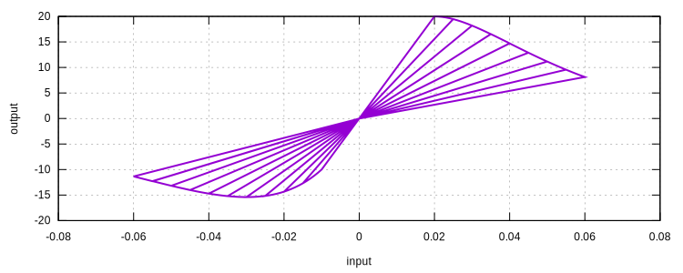

# CustomStressDegradation

Stress History Based Degradation With Custom Rules

This model implements the [universal damage model](Degradation.md) assuming the degradation factor depends on
the stress history.

## Syntax

```
material CustomStressDegradation (1) (2) (3) [4]
# (1) int, unique material tag
# (2) int, host intact material tag
# (3) int, tension degradation expression tag
# [4] int, compression degradation expression tag, default: (3)
```

## Remarks

It is possible to assign different degradation evolution rules for tension and compression.

The degradation expression shall take one scalar input and return a vector of two scalars, of which the first is the 
degradation factor while the second is the derivative of the degradation factor with respect to the input.

The degradations for positive/negative stresses are defined separately.

$$
D_{pos}=D_{pos}(\bar{\sigma}_{max}),\quad
D_{neg}=D_{neg}(\bar{\sigma}_{min}).
$$

In which $$\bar{\sigma}_{max}$$ is the maximum stress (positive) of the whole loading history,
and $$\bar{\sigma}_{min}$$ is the minimum stress (negative) of the whole loading history.

## Example

To use this model, expressions of degradation evolution rules must be defined first.
Assuming the degradation is an exponential function, and will be activated when the effective stress is larger than 20,

$$
D=\exp(-(\bar{\sigma}-20)/20),
$$

the corresponding derivative is then

$$
\dfrac{\mathrm{d}D}{\mathrm{d}\bar{\sigma}}=-\dfrac{1}{20}\exp(-(\bar{\sigma}-20)/20).
$$

One can then define the expression in a plain text file as follows.

```text
// file: exp_t
if(x>20){
	y[0]:=exp((-x+20)/20);
	y[1]:=-y[0]/20;
}else{
	y[0]:=1.;
	y[1]:=0.;
}
```

To use it, one shall use the [`SimpleVector`](../../../../Collection/Define/expression.md) expression.

```text
expression SimpleVector 1 x y|2 exp_t
```

Here we use $$x$$ as the input ($$\bar{\sigma}$$) and $$y[0]$$ as the degradation ($$D$$), $$y[1]$$ as the derivative 
($$\dfrac{\mathrm{d}D}{\mathrm{d}\bar{\sigma}}$$).

### Same Degradation for Tension and Compression

We use an elastic host material for demonstration.

```text
material Elastic1D 1 1000
expression SimpleVector 1 x y|2 exp_t
material CustomStressDegradation 2 1 1
materialTest1D 2 1E-3 10 20 25 30 35 40 45 50 55 60 65 70 75 80 85 90 95 100 105 110 115 120 60
```



### Different Degradation for Tension and Compression

We can define a different rule for compression.

```text
// file: exp_c
if(x<-10){
	y[0]:=exp((x+10)/30);
	y[1]:=y[0]/30;
}else{
	y[0]:=1.;
	y[1]:=0.;
}
```

```text
material Elastic1D 1 1000
expression SimpleVector 1 x y|2 exp_t
expression SimpleVector 2 x y|2 exp_c
material CustomStressDegradation 2 1 1 2
materialTest1D 2 1E-3 10 20 25 30 35 40 45 50 55 60 65 70 75 80 85 90 95 100 105 110 115 120 60
```


