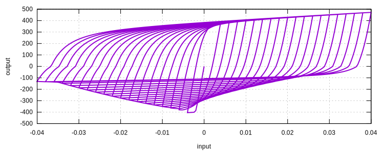

# Dhakal

Dhakal Degradation

## Reference

1. [10.1061/(ASCE)0733-9445(2002)128:9(1139)](https://doi.org/10.1061/(ASCE)0733-9445(2002)128:9(1139))

## Syntax

```text
material Dhakal (1) (2) (3) (4)
# (1) int, unique material tag
# (2) int, host material tag
# (3) double, yield strain
# (4) double, geometry parameter
```

## Theory

The model is proposed for modelling buckling of reinforcement bars in concrete members.

The geometry parameter `[4]` is defined as

$$
\sqrt{\dfrac{f_y}{100~\text{MPa}}}\dfrac{L}{D}.
$$

Since this parameter is calibrated according to dimensional constant $$100~\text{MPa}$$, the whole analysis must then
use the same unit system.

This is a common issue in lots of phenomenological models, which lack a clear implication of those ad-hoc parameters.

## Example

```text
material MPF 1 2E5 400 .01
material Dhakal 2 1 5E-3 50
materialTest1D 2 -4E-4 10 20 25 30 35 40 45 50 55 60 65 70 75 80 85 90 95 100 105 110 115 120 125 130 135 140 145 150 155 160 165 170 175 180 185 190 195 200 100
```


