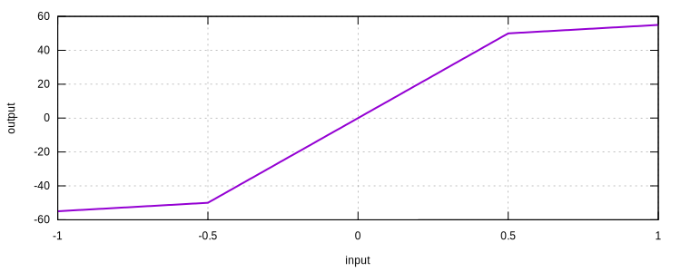

# BilinearElastic1D

Uniaxial Bilinear Elastic Material

## Syntax

```
material BilinearElastic1D (1) (2) (3) (4) [5]
# (1) int, unique material tag
# (2) double, elastic modulus
# (3) double, yield stress
# (4) double, hardening modulus
# [5] double, density, default: 0.0
```

## Usage

```
material BilinearElastic1D 1 100 50 0.1
```


