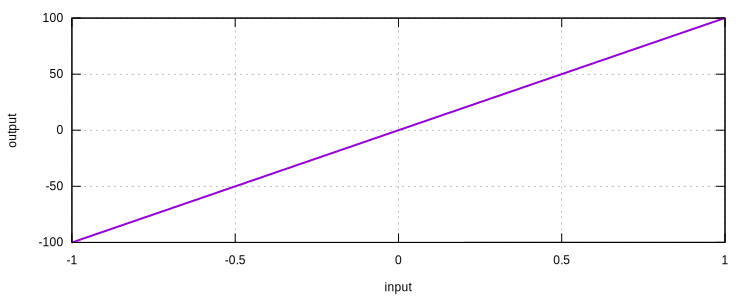

# Elastic1D

Uniaxial Elastic Material

## Syntax

```
material Elastic1D (1) (2) [3]
# (1) int, unique material tag
# (2) double, elastic modulus
# [3] double, density, default: 0.0
```

## Usage

```
material Elastic1D 1 100 0.
materialTest1D 1 1E-2 100 200
exit
```


