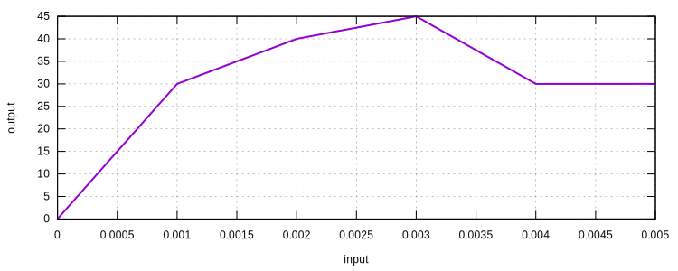

# MultilinearElastic1D

Uniaxial Multilinear Elastic Material

## Theory

A simple uniaxial multilinear elastic material model. The [`BilinearElastic1D`](BilinearElastic1D.md) model is a special
case of this model.

## Syntax

```
material MultilinearElastic1D (1) (2 3...) [4]
# (1) int, unique material tag
# (2) double, strain of the data point
# (3) double, stress of the data point
# [4] double, density, default: 0.0
```

## Usage

The first point does not need to be origin. Starting from the first non-zero point is fine. Multiple data points can be
defined. A constant response is assumed after the last point.

```
material MultilinearElastic1D 1 1E-3 35 2E-3 40 3E-3 45 4E-3 30
```


