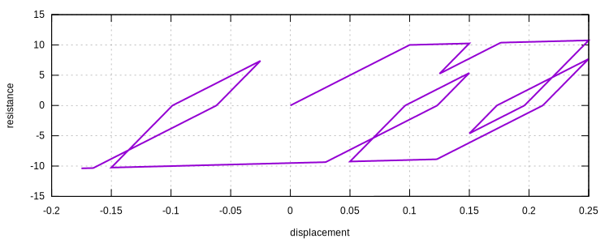
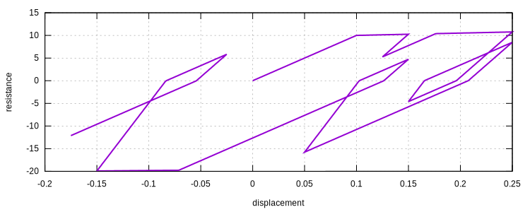
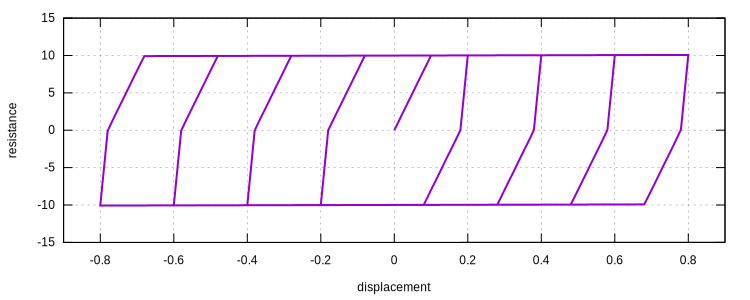

# AFC

Asymmetrical Friction Connection

## Theory

The `AFC` model is a bilinear hardening model with an unloading stiffness differs from the initial stiffness. The term
AFC comes from "asymmetric friction connection" which is a type of energy dissipaters. But this model can be used in
other applications.

## Syntax

```
material AFCS (1) (2) (3) (4) (5)
material AFC02 (1) (2) (3) (4) (5)
# (1) int, unique tag
# (2) double, elastic modulus
# (3) double, yield stress
# (4) double, hardening modulus
# (5) double, unloading modulus

material AFC (1) (2) (3) (4) (5) (6) (7) (8)
material AFC01 (1) (2) (3) (4) (5) (6) (7) (8)
# (1) int, unique tag
# (2) double, elastic modulus
# (3) double, tension yield stress
# (4) double, tension hardening modulus
# (5) double, tension unloading modulus
# (6) double, compression yield stress
# (7) double, compression hardening modulus
# (8) double, compression unloading modulus
```

## History Variable Layout

| location             | value          |
|----------------------|----------------|
| `initial_history(0)` | load_sign      |
| `initial_history(1)` | max_strain     |
| `initial_history(2)` | reverse_strain |
| `initial_history(3)` | start_strain   |
| `initial_history(4)` | start_stress   |
| `initial_history(5)` | end_strain     |
| `initial_history(6)` | end_stress     |

## Remarks

1. `AFC02` is a wrapper of `AFC01`. It provides a symmetric behavior while `AFC01` provides an asymmetric behavior.

## Examples

```
material AFC02 1 100 10 5 200
materialTest1D 1 1E-3 150 25 125 100 100 200 100 300 125 150
exit
```



```
material AFC01 1 100 10 5 200 20 2 300
materialTest1D 1 1E-3 150 25 125 100 100 200 100 300 125 150
exit
```



```
material AFC02 1 100 10 .1 500
materialTest1D 1 1E-2 20 40 60 80 100 120 140 160 80
exit
```


