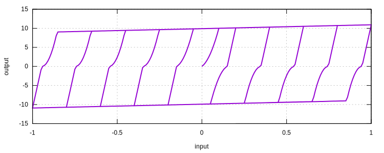

# AFCN

Nonlinear Version of AFC

## Theory

The difference between the [`AFC`](AFC.md) model and this AFCN model is the initial loading part. This AFCN model
accounts for additional slip-lock effect.

## Syntax

```
material AFCN (1) (2) (3) (4) (5) (6) (7) (8) [9] [10]
# (1) int, unique tag
# (2) double, elastic modulus
# (3) double, tension yield stress
# (4) double, tension hardening modulus
# (5) double, tension unloading modulus
# (6) double, compression yield stress
# (7) double, compression hardening modulus
# (8) double, compression unloading modulus
# [9] double, non-negative degradation paramater, default: 0.0
# [10] double, density, default: 0.0
```

## History Variable Layout

| location             | value          |
|----------------------|----------------|
| `initial_history(0)` | load_sign      |
| `initial_history(1)` | max_strain     |
| `initial_history(2)` | reverse_strain |
| `initial_history(3)` | start_strain   |
| `initial_history(4)` | start_stress   |
| `initial_history(5)` | end_strain     |
| `initial_history(6)` | end_stress     |

## Usage

```
material AFCN 1 100 10 1 200 10 1 200
materialTest1D 1 1E-2 20 40 60 80 100 120 140 160 80
exit
```


