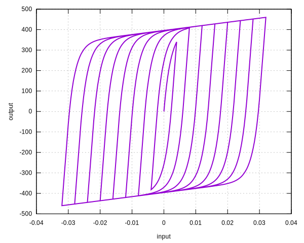
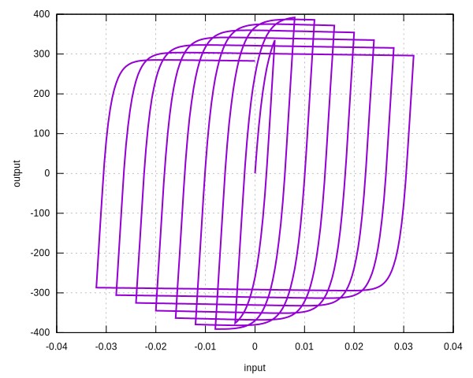
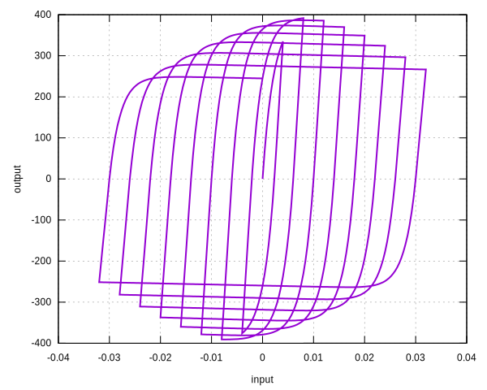
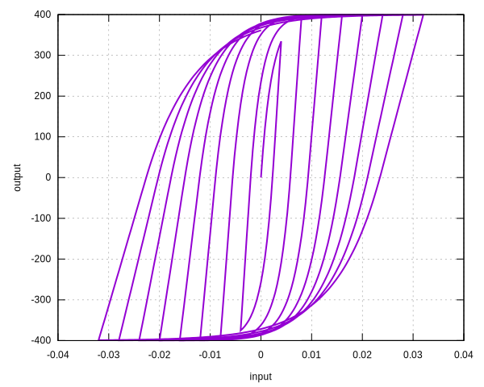
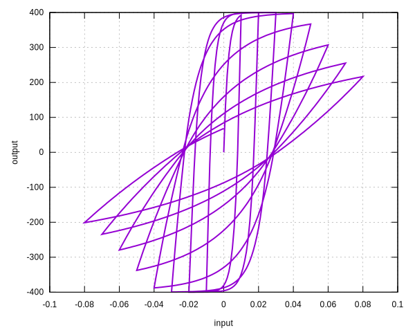

# BWBN

Bouc-Wen-Baber-Noori Model

The `BWBN` model is an extension of the `BoucWen` model with stiffness degradation, strength degradation and pinching
effect.

## Syntax

```
material BWBN (1) [2...18]
# (1) int, unique material tag
# [2] double, elastic modulus, default: 2E5
# [3] double, yield stress, default: 4E2
# [4] double, hardening ratio, default: 1E-2
# [5] double, \beta (>0), default: 0.5
# [6] double, exponent n (>0, normally >=1), default: 1.0
# [7] double, initial \nu (>0), default: 1.0
# [8] double, slope of \nu (>0), default: 0.0
# [9] double, initial \eta (>0), default: 1.0
# [10] double, slope of \eta (>0), default: 0.0
# [11] double, initial \phi (>0), default: 1.0
# [12] double, slope of \phi (>0), default: 0.0
# [13] double, \zeta (1>\zeta>0), default: 0.0
# [14] double, slope of A (>0), default: 0.0
# [15] double, p (>0), default: 0.0
# [16] double, q (>0), default: 0.0
# [17] double, \lambda (>0), default: 1.0
# [18] double, density, default: 0.0
```

## History Variable Layout

| location             | value |
|----------------------|-------|
| `initial_history(0)` | `z`   |

## Theory

The [Wikipedia](https://en.wikipedia.org/wiki/Bouc–Wen_model_of_hysteresis) page contains sufficient information about
the formulation of `BWBN` model. Some normalizations are carried out compared to the original model.

The evolution of internal displacement $$z(t)$$ is governed by the differential equation,

$$
\eta\Delta{}z=h\dfrac{\Delta{}u}{u_y}\left(A-\nu\left(\gamma+\text{sign}\left(z\cdot\Delta{}u\right)\beta\right)
\Big|z\Big|^n\right).
$$

Then,

$$
F=aF_y\dfrac{u}{u_y}+\left(1-a\right)F_yz.
$$

For state determination, $$z$$ is solved iteratively by using the Newton method. The evolutions of internal functions
rely on the dissipated energy $$e$$, which is defined to be a **normalized** quantity.

$$
e=\left(1-a\right)\int{}z~\mathrm{d}u.
$$

The trapezoidal rule is used so that

$$
\Delta{}e=\left(1-a\right)\dfrac{2z+\Delta{}z}{2}\Delta{}u.
$$

The evolutions are

$$
\begin{align*} \nu&=\nu_0+\delta_\nu{}e,\\[3mm]
\eta&=\eta_0+\delta_\eta{}e,\\[3mm]
A&=1-\delta_Ae,\\[3mm]
h&=1-\zeta_1\exp\left(-\left(\dfrac{z\cdot\text{sign}\left(\Delta{}u\right)-qz_u}{\zeta_2}\right)^2\right),\\[3mm]
\zeta_1&=\zeta\left(1-\exp\left(-pe\right)\right),\\[3mm]
\zeta_2&=\left(\phi_0+\delta_\phi{}e\right)\left(\lambda+\zeta_1\right),\\[3mm]
z_u&=\sqrt[n]{\dfrac{1}{\nu}}=\nu^{-1/n}. \end{align*}
$$

## Parameters

Strength degradation is controlled by $$\nu$$. To disable it, set $$\delta_\nu=0$$.

Stiffness degradation is controlled by $$\eta$$. To disable it, set $$\delta_\eta=0$$.

Pinching is controlled by $$h$$. To disable it, set $$\zeta=0$$ or $$p=0$$.

## Examples

### Vanilla Model

The default behavior is similar to a bilinear hardening material.

```
material BWBN 1
materialtest1d 1 4E-4 10 20 30 40 50 60 70 80 90 100 110 120 130 140 150 160 80
```



### Strength degradation

A positive $$\delta_\nu$$ enables strength degradation.

```
material BWBN 1 2E5 4E2 0 .5 1. 1. 1E0 1. 0. 1. 0. 0. 0. 0. 0. 1. 0.
materialtest1d 1 4E-4 10 20 30 40 50 60 70 80 90 100 110 120 130 140 150 160 80
```



A positive $$\delta_A$$ has the similar effect.

```
material BWBN 1 2E5 4E2 0 .5 1. 1. 0. 1. 0. 1. 0. 0. 1E0 0. 0. 1. 0.
materialtest1d 1 4E-4 10 20 30 40 50 60 70 80 90 100 110 120 130 140 150 160 80
```



### Stiffness degradation

A positive $$\delta_\eta$$ enables stiffness degradation.

```
material BWBN 1 2E5 4E2 0 .5 1 1 0 1 1E1 1 0 1 0 1 1 0 0
materialtest1d 1 4E-4 10 20 30 40 50 60 70 80 90 100 110 120 130 140 150 160 80
```



### Pinching Effect

The pinching effect is governed by $$\phi_0$$, $$\delta_\phi$$, $$\zeta$$, $$p$$, $$q$$ and $$\lambda$$.

```
material BWBN 1 2E5 4E2 0 .5 1. 1. 0. 1. 0. 1. 1E1 1. 0. 1E1 1E0 1. 0.
materialtest1d 1 1E-3 10 20 30 40 50 60 70 80 90 100 110 120 130 140 150 160 80
```


