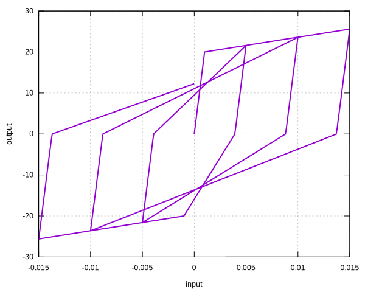

# BilinearPO

Bilinear Peak Oriented Model

## Syntax

For symmetric response between compression and tension,

```
material BilinearPO (1) (2) (3) (4) [5]
# (1) int, unique material tag
# (2) double, elastic modulus
# (3) double, yield strain
# (4) double, hardening ratio
# [5] double, density, default: 0.0
```

For asymmetric response,

```
material BilinearPO (1) (2) (3) (4) (5) (6) [7]
# (1) int, unique material tag
# (2) double, elastic modulus
# (3) double, tension yield strain
# (4) double, tension hardening ratio
# (5) double, compression yield strain
# (6) double, compression hardening ratio
# [7] double, density, default: 0.0
```

## History Variable Layout

Since it is derived from the [`SimpleHysteresis`](../Hysteresis/SimpleHysteresis.md) model, they share the same history
variable layout.

## Example

### Symmetric Response

```
material BilinearPO 1 2E4 1E-3 .02
materialTest1D 1 1E-4 50 100 150 200 250 300 150
```



### Asymmetric Response

```
material BilinearPO 1 2E4 1E-3 .02 2E-3 -.05
materialTest1D 1 1E-4 50 100 150 200 250 300 150
```


