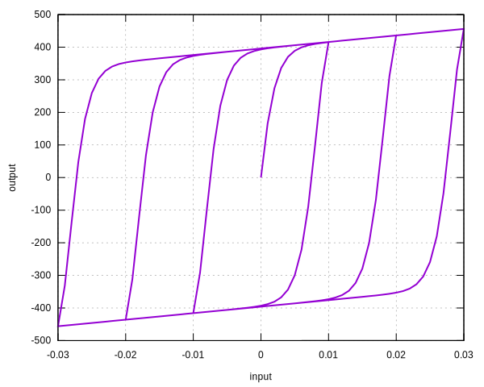
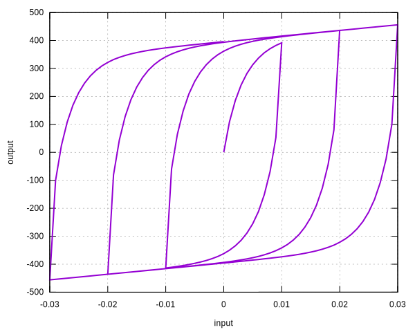

# BouncWen

Bouc-Wen Model

The `BoucWen` model is a phenomenological model. Compared to the original formulation, the following modifications are
applied.

1. $$A=1$$.
2. $$\gamma+\beta=1$$.

## Theory

The evolution of internal displacement $$z(t)$$ is governed by the differential equation,

$$
\Delta{}z=\dfrac{\Delta{}u}{u_y}\left(1-\left(\gamma+\text{sign}\left(z\cdot\Delta{}u\right)\beta\right)
\Big|z\Big|^n\right).
$$

Then,

$$
F=aF_y\dfrac{u}{u_y}+\left(1-a\right)F_yz.
$$

For state determination, $$z$$ is solved by using the Newton method.

## Syntax

```
material BoucWen (1) (2) (3) (4) (5) (6)
# (1) int, unique material tag
# (2) double, elastic modulus
# (3) double, yield stress
# (4) double, hardening ratio
# (5) double, beta, a positive parameter
# (6) double, n, a positive exponent
```

## Caveat

Since it is a phenomenological model, the non-observable internal "displacement" $$z$$ has no physical meaning. For
small loops, it violates plasticity postulates.

It is recommended to use a value greater than unity for $$n$$.

## Example

```
material BoucWen 1 2E5 400 .01 1E-1 2
materialTest1D 1 1E-3 10 20 30 40 50 60 30
```



```
material BoucWen 1 2E5 400 .01 2. .6
materialTest1D 1 1E-3 10 20 30 40 50 60 30
```


