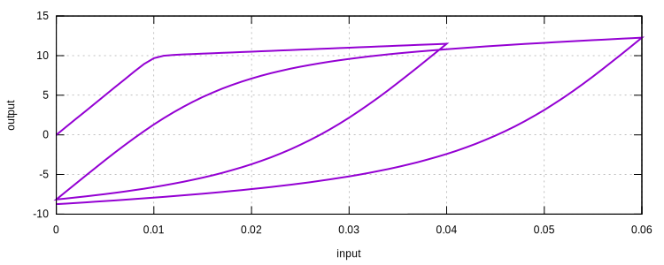

# MPF

Menegotto-Pinto-Filippou Steel Model

## Syntax

```
material MPF (1) (2) (3) [4] [5] [6] [7] [8] [9] [10] [11] [12]
# (1) int, unique material tag
# (2) double, elastic modulus
# (3) double, initial yield stress
# [4] double, hardening ratio, default: 0.05
# [5] double, R0, default: 20.0
# [6] double, A1, default: 18.5
# [7] double, A2, default: 0.15
# [8] double, A3, default: 0.01
# [9] double, A4, default: 7.0
# [10] bool string, isotropic hardening switch, default: false
# [11] bool string, constant radius switch, default: false
# [12] double, density, default: 0.0
```

## History Variable Layout

| location                | value                        |
|-------------------------|------------------------------|
| `initialize_history(0)` | reverse_stress               |
| `initialize_history(1)` | reverse_strain               |
| `initialize_history(2)` | intermediate_stress          |
| `initialize_history(3)` | intermediate_strain          |
| `initialize_history(4)` | previous_intermediate_strain |
| `initialize_history(5)` | max_strain                   |
| `initialize_history(6)` | load_sign                    |

## Remarks

1. The isotropic hardening switch can be turned on to use Filippou's modification.
2. If constant radius switch is on, $$R=R_0=20.0$$ is unchanged.

## Example

```
material MPF 1 1000 10
materialTest1D 1 0.001 40 40 60 60
```


