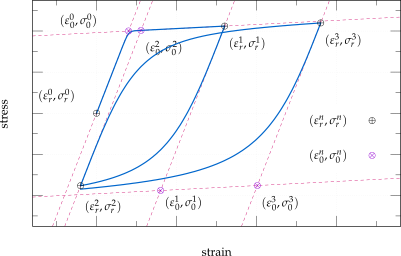
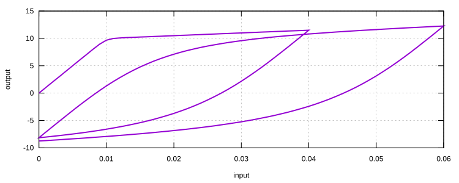

# MPF

Menegotto-Pinto-Filippou Steel Model

## Syntax

```text title="MPF"
material MPF (1) (2) (3) [4] [5] [6] [7] [8] [9] [10] [11] [12]
# (1) int, unique material tag
# (2) double, elastic modulus
# (3) double, initial yield stress
# [4] double, hardening ratio, default: 0.05
# [5] double, R0, default: 20.0
# [6] double, A1, default: 18.5
# [7] double, A2, default: 0.15
# [8] double, A3, default: 0.01
# [9] double, A4, default: 7.0
# [10] bool string, isotropic hardening switch, default: false
# [11] bool string, constant radius switch, default: false
# [12] double, density, default: 0.0
```

## History Variable Layout

| location                | value                        |
|-------------------------|------------------------------|
| `initialize_history(0)` | reverse_stress               |
| `initialize_history(1)` | reverse_strain               |
| `initialize_history(2)` | intermediate_stress          |
| `initialize_history(3)` | intermediate_strain          |
| `initialize_history(4)` | previous_intermediate_strain |
| `initialize_history(5)` | max_strain                   |
| `initialize_history(6)` | load_sign                    |

## Theory

The strain-stress relationship can be expressed as

$$
\sigma_n=b\varepsilon_n+\dfrac{\varepsilon_n-b\varepsilon_n}{\sqrt[R]{1+\varepsilon_n^R}},
$$

with the normalized stress $$\sigma_n$$ and strain $$\varepsilon_n$$ and parameter $$R$$ that controls curvature defined as

$$
\sigma_n=\dfrac{\sigma-\sigma_r}{\sigma_0-\sigma_r},\quad\varepsilon_n=\dfrac{\varepsilon-\varepsilon_r}{\varepsilon_0-\varepsilon_r},\quad{}R=R_0-\dfrac{a_1\xi}{a_2+\xi},\quad\xi^n=\dfrac{\left|\varepsilon_r^{n}-\varepsilon_0^{n-1}\right|}{\varepsilon_{y,0}},\qquad(n>1).
$$

The other parameters are: $$b$$ controls hardening, $$\sigma_y=\sigma_0^0$$ and $$\varepsilon_y=\varepsilon_0^0$$ are initial yielding stress and strain so that $$E=\sigma_y/\varepsilon_y$$ defines Young's modulus, and three dimensionless parameters with recommended values $$R_0=20$$, $$a_1=18.5$$ and $$a_2=0.15$$.
The parameter $$\xi$$ controls the Bauschinger effect.
It can be set to zero so that $$R=R_0$$ remains unchanged for the whole loading history.
As the result, the corresponding response resembles the one of a bilinear hardening material.
The parameters $$a_3$$ and $$a_4$$ control isotropic hardening, thus are only used when isotropic hardening is activated.



The governing equation defines a smooth transition curve that asymptotically approaches a limit (linear hardening bound) controlled by the height (reference stress magnigude) and the corresponding hardening ratio.

## Remarks

1. The isotropic hardening switch can be turned on to use Filippou's modification.
2. If constant radius switch is on, $$R=R_0=20.0$$ is unchanged.

## Example

```
material MPF 1 1000 10
materialTest1D 1 0.001 40 40 60 60
```


