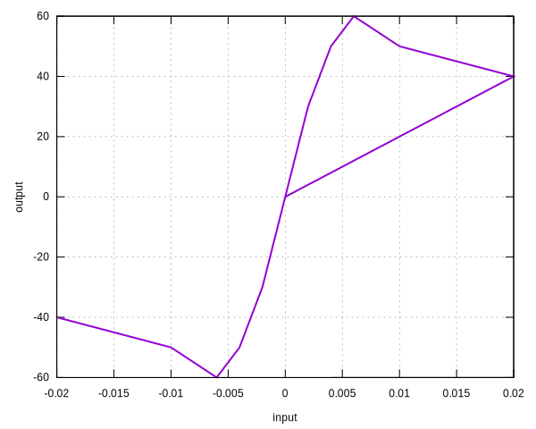

# MultilinearOO

Multilinear Origin Oriented Hysteresis Model

## Syntax

```
material MultilinearOO (1) (2) (3) [4]
# (1) int, unique material tag
# (2) string, file name of tension backbone
# (3) string, file name of compression backbone
# [4] double, density, default: 0.0
```

## History Variable Layout

Since it is derived from the [`SimpleHysteresis`](../Hysteresis/SimpleHysteresis.md) model, they share the same history
variable layout.

## Remarks

1. The backbone file must have exact two columns, stores turning points of the backbone.
2. The origin does not need to be included.
3. Tension backbone shall be positive.
4. Compression backbone shall be negative, positive table will be converted to negative.
5. If strain exceeds the last point, the last stress will be returned.

## Examples

Backbone is stored in file `Backbone`.

```
.002 30
.004 50
.006 60
.01 50
.02 40
```

```
material MultilinearOO 1 Backbone Backbone
materialTest1D 1 1E-4 200 400
```


