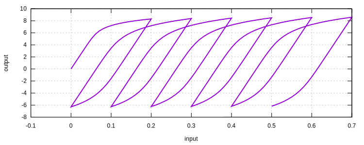
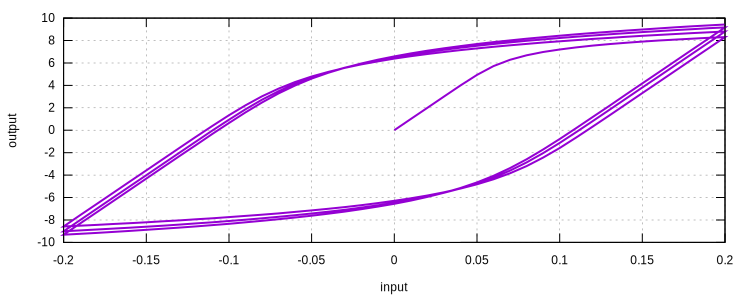
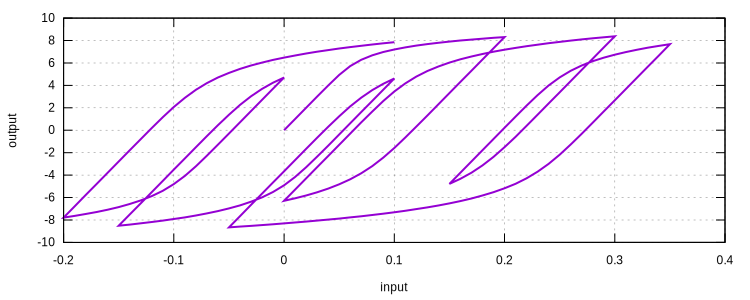

# RambergOsgood

Ramberg-Osgood Steel Model

## Syntax

```
material RambergOsgood (1) (2) (3) [4] [5] [6]
# (1) int, unique material tag
# (2) double, elastic modulus
# (3) double, initial yield stress
# [4] double, offset alpha, default: 1.0
# [5] double, n, default: 4.0
# [6] double, density, default: 0.0
```

## History Variable Layout

| location                | value                   |
|-------------------------|-------------------------|
| `initialize_history(0)` | load_sign               |
| `initialize_history(1)` | reverse_strain          |
| `initialize_history(2)` | reverse_stress          |
| `initialize_history(3)` | previous_reverse_strain |
| `initialize_history(4)` | previous_reverse_stress |

## Remarks

1. Local iterations are required to obtain the stress value.

## Theory

The Ramberg-Osgood relationship is defined as

$$
\varepsilon=\dfrac{\sigma}{E}+\alpha\dfrac{\sigma}{E}(\dfrac{\sigma}{\sigma_0})^{n-1}
$$

where $$\alpha$$ is the offset and $$n$$ is the material constant controls hardening. Noting that
$$\varepsilon=\varepsilon_e+\varepsilon_p=\dfrac{\sigma}{E}+\varepsilon_p$$, hence

$$
\dfrac{\sigma}{E}+\varepsilon_p=\dfrac{\sigma}{E}+\alpha\dfrac{\sigma}{E}(\dfrac{\sigma}{\sigma_0})^{n-1}
$$

so

$$
\varepsilon_p=\alpha\dfrac{\sigma}{E}(\dfrac{\sigma}{\sigma_0})^{n-1}.
$$

At the yield stress, viz., $$\sigma=\sigma_0$$, then

$$
\varepsilon_p=\alpha\varepsilon_e.
$$

So the offset $$\alpha$$ indicates the magnitude of plastic strain at yield stress.

The cyclic response uses the difference between current reverse stress and previous reverse stress as "yield stress".

## Examples

```
material RambergOsgood 1 100.0 8.0 1 10.0
materialTest1D 1 1E-2 20 20 30 20 30 20 30 20 30 20 30 20
exit
```



```
material RambergOsgood 1 100.0 8.0 1 10.0
materialTest1D 1 1E-2 20 40 40 40 40 40 40
exit
```



```
material RambergOsgood 1 100.0 8.0 1 10.0
materialTest1D 1 1E-2 20 20 30 15 20 40 15 25 15 20 30
exit
```


