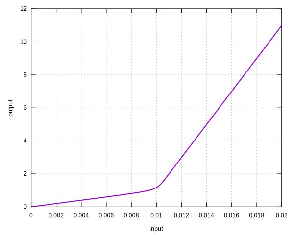

# SlipLock

Slip-Lock Material

This model describes a slip-lock material model. It is a nonlinear elastic model, the initial stiffness is small, with
the increasing strain/displacement, the stiffness becomes larger. The upper bound can be customized.

## Syntax

```
material SlipLock (1) (2) (3) (4) [5] [6]
# (1) int, unique material tag
# (2) double, elastic modulus
# (3) double, initial yield strain
# (4) double, hardening ratio
# [5] double, radius, default: 20.0
# [6] double, density, default: 0
```

## Example

```
material SlipLock 1 100 1E-2 10 10
materialTest1D 1 1E-4 200
```


