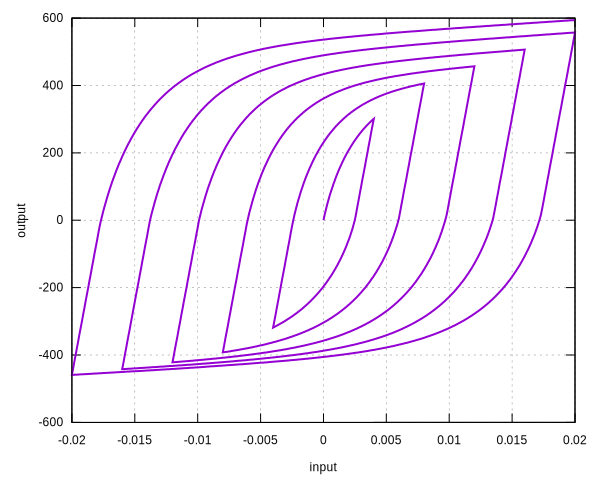

# SteelBRB

Steel Model For Modelling BRB

The `SteelBRB` material defines a steel model. It can be used to model buckling restrained braces. It uses exponential
type functions thus resembles the [`RambergOsgood`](RambergOsgood.md) material.

References are available:

1. [https://doi.org/10.1016/j.jcsr.2011.07.017](https://doi.org/10.1016/j.jcsr.2011.07.017)
2. [https://doi.org/10.1016/j.jcsr.2014.02.009](https://doi.org/10.1016/j.jcsr.2014.02.009)

## Syntax

If tension response is identical to compression response, users can use the following command to define the material.

```
material SteelBRB (1) (2) (3) (4) (5) (6) (7) [8]
# (1) int, unique material tag
# (2) double, elastic modulus
# (3) double, yield stress
# (4) double, plastic modulus
# (5) double, saturated stress, \sigma_s
# (6) double, \delta_r
# (7) double, \alpha
# [8] double, density, default: 0.0
```

If tension response is different from compression response, which is often the case in modelling BRB, users can use the
following command.

```
material SteelBRB (1) (2) (3) (4) (5) (6) (7) (8) (9) (10) [11]
# (1) int, unique material tag
# (2) double, elastic modulus
# (3) double, yield stress
# (4) double, plastic modulus
# (5) double, tension saturated stress
# (6) double, tension delta_r
# (7) double, tension alpha
# (8) double, compression saturated stress
# (9) double, compression delta_r
# (10) double, compression alpha
# [11] double, density, default: 0.0
```

## Remarks

1. In the original model, a linear response is defined before the initial yield stress, this feature is disabled. Thus,
   the monotonic loading response is similar to that of the `RambergOsgood` material.
2. In the original model, the elastic and plastic moduli could be different under tension and compression. The
   implemented model uses identical values for these two parameters.

## History Variable Layout

| location             | value                      |
|----------------------|----------------------------|
| `initial_history(0)` | accumulated plastic strain |
| `initial_history(1)` | plastic strain             |

## Theory

The model is described in incremental form. The total strain increment is decomposed into elastic and plastic part,

$$
\dot\sigma=E(\dot\varepsilon-\dot\varepsilon_p).
$$

For loading, the increment of plastic strain is defined as an implicit function, that is

$$
\dot\varepsilon_p=\Big|\dfrac{\sigma-\sigma_p}{\sigma_y}\Big|^\alpha\dot\varepsilon,
$$

in which $$\sigma_p$$ is associated with $$\varepsilon_p$$ via plastic modulus $$H$$,

$$
\sigma_p=H\varepsilon_p,
$$

and

$$
\sigma_y=\sigma_s-(\sigma_s-\sigma_{y,0})\exp(-\dfrac{\mu}{\delta_r})
$$

where $$\sigma_s$$ is the saturated stress, $$\sigma_y$$ is the yield stress, $$\delta_r$$ is a constant parameter that
controls the speed of isotropic hardening, $$\mu$$ is the accumulated plastic strain which is defined to be

$$
\dot\mu=|\dot\varepsilon_p|.
$$

In the above formulation, $$\sigma_s$$, $$\alpha$$ and $$\delta_r$$ could be different in tension and compression.

The development of plastic strain $$\varepsilon_p$$ is activated when

$$
\dot\varepsilon\sigma<0
$$

## Example

```
material SteelBRB 1 2E5 400. 2E3 660. .2 .6 450. .15 .4
materialTest1D 1 1E-4 40 80 120 160 200 240 280 320 360 400 400
```


