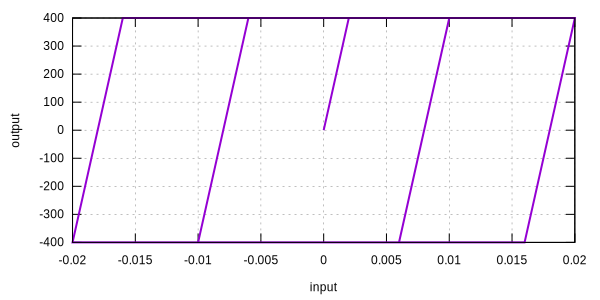
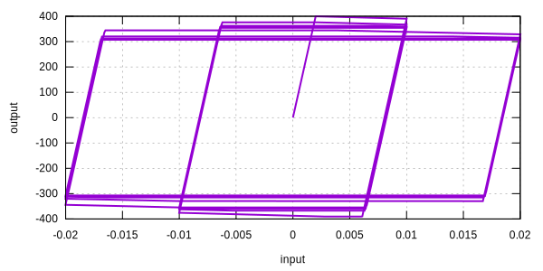

# AFCO1D

This is an extension of [`ArmstrongFrederick1D`](ArmstrongFrederick1D.md) model.

The name represents the following.

`AF` --- Armstrong-Frederick type kinematic hardening rule
`CO` --- Chaboche-Ohno type isotropic hardening reduction rule

## References

1. [1840.20/26854](http://www.lib.ncsu.edu/resolver/1840.20/26854)
2. [10.1016/0013-7944(85)90095-5](https://doi.org/10.1016/0013-7944(85)90095-5)
3. [10.1115/1.3162603](https://doi.org/10.1115/1.3162603)

## Syntax

```
material AFCO1D (1) (2) (3) (4) (5) (6) (7) (8) (9) [(10) (11)...] [12]
# (1) int, unique material tag
# (2) double, elastic modulus
# (3) double, yield stress, \sigma^i
# (4) double, saturation stress, \sigma^s
# (5) double, linear isotropic hardening modulus, K
# (6) double, m
# (7) double, c, between 0 and 1
# (8) double, w
# (9) double, reduction, \sigma^r
# (10) double, a
# (11) double, b
# [12] double, density, default: 0.0
```

## Theory

Compared to [`ArmstrongFrederick1D`](ArmstrongFrederick1D.md), this `AFCO1D` model further adopts the concept of a non-hardening plastic strain region.
It is described by the following surface.

$$
h=|\varepsilon^p-\theta|-r
$$

In which, $$\theta$$ points to the centre of the non-hardening plastic strain region.
It may be called the back plastic strain.
The field $$r$$ describes the size of this surface.
It is further used to introduce a reduction term in the isotropic hardening.

$$
\sigma^y=\sigma^i+Kq+\sigma^s\left(1-e^{-mq}\right)-\sigma^r\left(1-e^{-wr}\right).
$$

Further details can be found in the corresponding section
in [Constitutive Modelling Cookbook](https://github.com/TLCFEM/constitutive-modelling-cookbook/releases/download/latest/COOKBOOK.pdf).

## Examples

With a perfectly plastic response, the [`ArmstrongFrederick1D`](ArmstrongFrederick1D.md) presents a non-degrading envelop.

```text
material ArmstrongFrederick1D 1 2E5 4E2 0 0 0
materialTest1D 1 1E-4 100 200 200 200 200 200 200 200 200 200 200 200 200 200 200 300 400 400 400 400 400 400 400 400 400 400 400 400 400 400 400 400 400 400 400
exit
```

The cyclic response is the following.



By introducing the reduction, one can obtain the following.

```text
material AFCO1D 1 2E5 4E2 0 0 0 .2 20. 300.
materialTest1D 1 1E-4 100 200 200 200 200 200 200 200 200 200 200 200 200 200 200 300 400 400 400 400 400 400 400 400 400 400 400 400 400 400 400 400 400 400 400
exit
```


