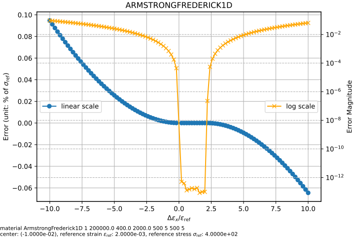

# ArmstrongFrederick1D

1D Armstrong-Frederick Steel Model

This model is a uniaxial version of the [`ArmstrongFrederick`](../../Material3D/vonMises/ArmstrongFrederick.md) steel model.
Readers can also refer to the corresponding section in [Constitutive Modelling Cookbook](https://github.com/TLCFEM/constitutive-modelling-cookbook/releases/download/latest/COOKBOOK.pdf) for details on the theory.

## Theory

A von Mises type yield function is used.
The associated plasticity is assumed.
Both isotropic and kinematic hardening rules are employed.

### Isotropic Hardening

An exponential function is added to the linear hardening law.

$$
\sigma^y=\sigma^i+Kq+\sigma^s(1-e^{-m^sq}),
$$

where $$\sigma^i$$ is the initial elastic limit (yielding stress), $$\sigma^s$$ is the saturation stress, $$K$$ is the
linear hardening modulus, $$m^s$$ is a constant that controls the speed of hardening,
$$\mathrm{d}q=|\mathrm{d}\varepsilon^p|$$ is the rate of accumulated plastic strain $$q$$.

### Kinematic Hardening

The Armstrong-Frederick type rule is used.
Multiple back stresses are defined,

$$
\beta=\sum\beta_i
$$

in which

$$
\mathrm{d}\beta_i=a_i~\mathrm{d}\varepsilon^p-b_i\beta~\mathrm{d}q,
$$

where $$a_i$$ and $$b_i$$ are material constants.

## Syntax

The following applies to `v3.6` and later.
Check the older syntax in the older version of the documentation.

```
material ArmstrongFrederick1D (1) (2) (3) (4) (5) (6) [(7) (8)...] [9]
# (1) int, unique material tag
# (2) double, elastic modulus
# (3) double, yield stress, \sigma^i
# (4) double, linear hardening modulus, K
# (5) double, saturation stress, \sigma^s
# (6) double, m^s, saturation rate
# (7) double, a_i, kinematic hardening
# (8) double, b_i, kinematic hardening
# [9] double, density, default: 0.0
```

## Example

### Kinematic Hardening Only With No Elastic Range

```
material ArmstrongFrederick1D 1 2E2 0. 0. 0. 0. 50 500.
```

The maximum stress can be computed as

$$
\sigma_{\text{max}}=\sigma^i+\sum\dfrac{a_i}{b_i}=\dfrac{50}{500}=0.1.
$$


## Accuracy

```py
from plugins import ErrorLine
# note: the dependency `ErrorLine` can be found in the following link
# https://github.com/TLCFEM/suanPan-manual/blob/dev/plugins/scripts/ErrorLine.py

young_modulus = 2e5
yield_stress = 4e2
hardening_ratio = 0.01

with ErrorLine(
    f"material ArmstrongFrederick1D 1 {young_modulus} {yield_stress} {hardening_ratio * young_modulus} 500 5 500 5",
    ref_strain=yield_stress / young_modulus,
    ref_stress=yield_stress,
) as error_map:
    error_map.contour("af1d", center=-5, size=10, type={"abs"})
```


