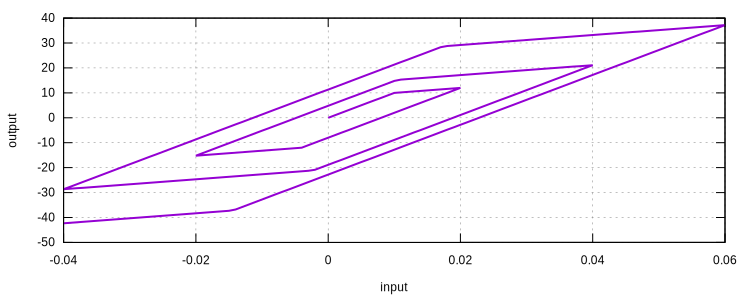
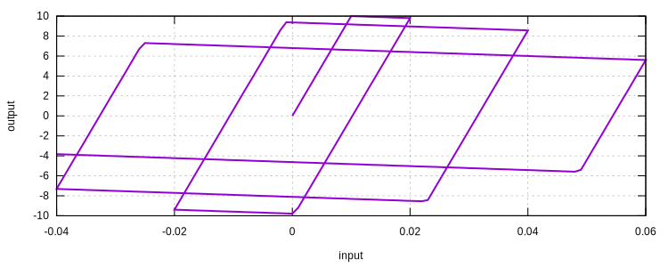
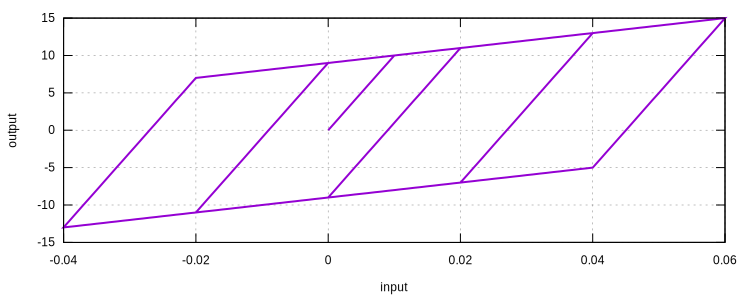
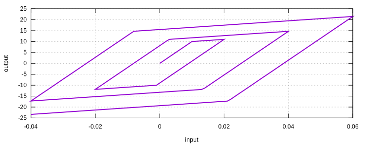
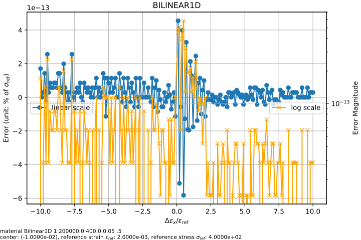

# Bilinear1D

Uniaxial Bilinear Material Using J2 Plasticity

The `Bilinear1D` material implements a simple plasticity model that employs both linear isotropic and kinematic hardening rules.
Further details can be found Section 1.4.4 of [Computational Inelasticity ](https://doi.org/10.1007/b98904).
Alternatively, refer to the corresponding section
in [Constitutive Modelling Cookbook](https://github.com/TLCFEM/constitutive-modelling-cookbook/releases/download/latest/COOKBOOK.pdf)
for implementation details.

It is suitable for simple hysteresis modelling.
For more complex behaviour, one shall use other models.

## Syntax

```
material Bilinear1D (1) (2) (3) [4] [5] [6]
# (1) int, unique material tag
# (2) double, elastic modulus
# (3) double, initial yield stress
# [4] double, hardening ratio, default: 0.0
# [5] double, beta, default: 1.0
# [6] double, density, default: 0.0
```

## History Variable Layout

| location                | value                     |
|-------------------------|---------------------------|
| `initialize_history(0)` | back_stress               |
| `initialize_history(1)` | equivalent_plastic_strain |

## Remarks

1. The parameter `beta` is employed for mixed hardening rule: zero $$0.0$$ for kinematic hardening and unity $$1.0$$ for
   isotropic hardening, anything falls in the range indicates a mixed hardening response.
2. Negative hardening ratio (softening) is supported. However, the yield surface will always be non-negative.

## Usage

### Isotropic Hardening

```
material Bilinear1D 1 1000.0 10.0 0.2 1.0
materialTest1D 1 0.001 20 40 60 80 100 100
exit
```



### Isotropic Softening

```
material Bilinear1D 1 1000.0 10.0 -0.02 1.0
materialTest1D 1 0.001 20 40 60 80 100 100
exit
```



### Kinematic Hardening

```
material Bilinear1D 1 1000.0 10.0 0.1 0.0
materialTest1D 1 0.001 20 40 60 80 100 100
exit
```



### Combined Hardening

```
material Bilinear1D 1 1000.0 10.0 0.1 0.5
materialTest1D 1 0.001 20 40 60 80 100 100
exit
```



## Accuracy

There is no local iteration required.
The result is accurate.

```py
from plugins import ErrorLine
# note: the dependency `ErrorLine` can be found in the following link
# https://github.com/TLCFEM/suanPan-manual/blob/dev/plugins/scripts/ErrorLine.py

young_modulus = 2e5
yield_stress = 4e2
hardening_ratio = 0.05

with ErrorLine(
    f"material Bilinear1D 1 {young_modulus} {yield_stress} {hardening_ratio} .5",
    ref_strain=yield_stress / young_modulus,
    ref_stress=yield_stress,
) as error_map:
    error_map.contour("bilinear1d", center=-5, size=10, type={"abs"})
```


