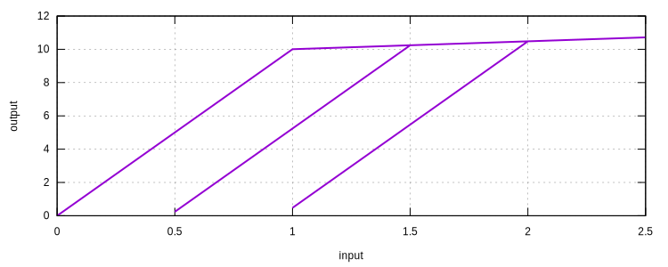
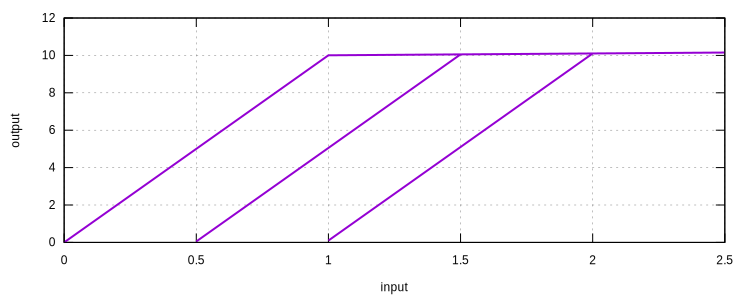

# CustomMises1D

J2 Plasticity Model With Custom Hardening

## Theory

This model is an implementation of the [`Mises1D`](Mises1D.md) abstract model.

## Syntax

```
material CustomMises1D (1) (2) (3) (4) [5]
# (1) int, unique material tag
# (2) double, elastic modulus
# (3) int, isotropic hardening expression tag
# (4) int, kinematic hardening expression tag
# [5] double, density, default: 0.0
```

## Usage

Both the isotropic and kinematic hardening functions are provided
by [Expression](../../../../Collection/Define/expression.md) objects.

Both hardening functions shall be defined in terms of the equivalent plastic strain.

The isotropic hardening function evaluates to the yield stress for trivial equivalent plastic strain.


## Example

### Isotropic Hardening

For example, one can define a purely isotropic hardening model as follows:

```
expression SimpleScalar 1 x 10+.5x
expression SimpleScalar 2 x 0

material CustomMises1D 1 10 1 2

materialTest1D 1 1E-2 150 150 200 200 250
```

In the above example, the isotropic hardening function is defined as:

$$
y=10+0.5x,
$$

in which $$x$$ maps to the equivalent plastic strain and $$y$$ maps to the shifted stress.

The kinematic hardening function is defined as:

$$
y=0.
$$

For elastic modulus of $$E=10$$, the isotropic hardening ratio satisfies:

$$
0.5=E\dfrac{H}{1-H},
$$

solving which yields $$H=0.04762$$.

The last point is $$11.190476190476174$$, then

$$
\dfrac{10.714285714285706-10}{2.5-1}=0.04762E.
$$



### Kinematic Hardening

```text
expression SimpleScalar 1 x 10
expression SimpleScalar 2 x .1x

material CustomMises1D 1 10 1 2
materialTest1D 1 1E-2 150 100 150 100 150
```

In the above example, purely kinematic hardening is defined.

The hardening ratio is $$0.1/(E+0.1)=0.0099$$.

The last point is $$10.074626865671641$$, then

$$
\dfrac{10.148514851485146-10}{2.5-1}=0.0099.
$$



With custom functions, it is possible to define arbitrary hardening rules.
