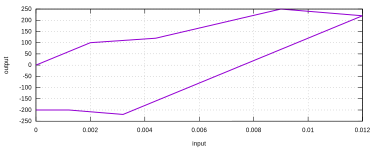

# Multilinear1D

Uniaxial Multilinear Material Using J2 Plasticity

## Syntax

```
material Multilinear1D (1) (2) (3) (4 5...)
# (1) int, unique material tag
# (2) double, elastic modulus
# (3) double, density
# (4 5...) double, pairs of stress and plastic strain
```

## Remarks

1. No kinematic hardening is defined in this model.
2. The stress will be constant after the last point defined. This means the yield surface does not change its size after
   the last point. So the stiffness will be singular. This may cause instability issues in analysis.
3. The first plastic strain ***must*** be zero.

## Usage

```
material Multilinear1D 1 50000 1. 0. 100 2E-3 120 4E-3 250 1E-2 200
materialTest1D 1 1E-4 120 120
exit
```

The above command defines the backbone using the following data.

| plastic strain | stress |
|----------------|--------|
| 0E0            | 100    |
| 2E-3           | 120    |
| 4E-3           | 250    |
| 1E-2           | 200    |
|                | 200    |

### Examples


