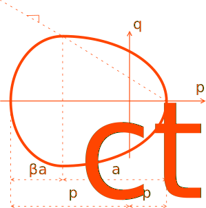
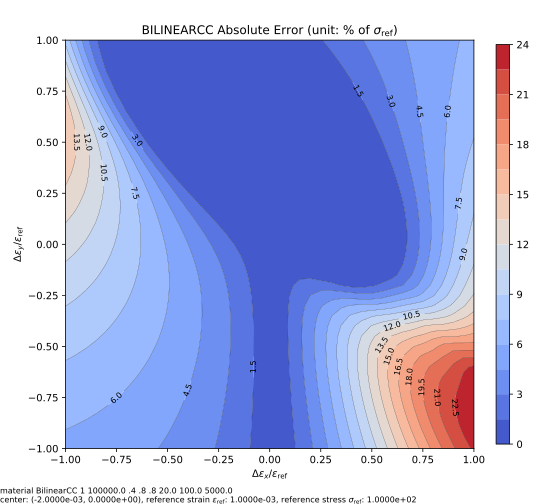
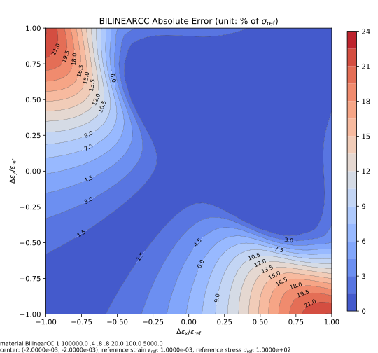

# NonlinearCamClay

Modified Cam-Clay Model

The `NonlinearCamClay` class defines a basic framework using modified Cam-Clay yield surface and associative flow rule.
Theories can be seen in Chapter 10
in [Computational Methods for Plasticity: Theory and Application](https://doi.org/10.1002/9780470694626), in which there
are some minor errors in the derivation of consistent stiffness.

This model resembles the one in ABAQUS but the third stress invariant does not enter yield surface. As a result, the
yield surface on the $$\pi$$-plane is a circle.

Interested readers can also refer to the corresponding section
in [Constitutive Modelling Cookbook](https://github.com/TLCFEM/constitutive-modelling-cookbook/releases/download/latest/COOKBOOK.pdf)
for more details.

The following function is chosen as the yield surface.

$$
F(\sigma,a)=\dfrac{(p-p_t+a)^2}{b^2}+\dfrac{q^2}{M^2}-a^2
$$

where $$p(\sigma)=\dfrac{1}{3}(\sigma_1+\sigma_2+\sigma_3)$$ is the hydrostatic pressure, $$q^2(\sigma)=\dfrac{3}{2}s:
s$$ with $$s$$ denotes the deviatoric stress, $$a(\alpha)$$ is a hardening function in terms of internal hardening
variable $$\alpha$$ that is defined as volumetric plastic strain, that is $$\alpha=\varepsilon_v^p$$. $$b=1$$ when
$$p-p_t+a\ge0$$ and $$b=\beta$$ when $$p-p_t+a<0$$. This $$\beta$$ parameter changes the radius of the second half of
this ellipse on the compressive side of the hydrostatic axis. The constant $$M$$ modifies the radius of the ellipse
along the $$q$$ axis.



The same function is used for plasticity potential so that $$G=F$$ and

$$
\dot{\varepsilon_p}=\dot{\gamma}\dfrac{\partial{}G}{\partial\sigma}=\dot{\gamma}(\dfrac{3}{M^2}s+\dfrac{2(p-p_t+a)
}{3b^2}I)
$$

where $$I=[1~1~1~0~0~0]^\mathrm{T}$$ is the second order unit tensor.

The `NonlinearCamClay` class allows $$a(\alpha)$$ to be user defined, where $$\alpha$$ is the volumetric plastic strain.

$$
\alpha=\int\dot{\varepsilon}_v^p\mathrm{d}t.
$$

Please note in practical applications, this value is negative as soil is often in compression.

## History Layout

| location             | paramater                  |
|----------------------|----------------------------|
| `initial_history(0)` | accumulated plastic strain |

## Iso-error Map

The following example iso-error maps are obtained via the following script.

```py
from plugins import ErrorMap
# note: the dependency `ErrorMap` can be found in the following link
# https://github.com/TLCFEM/suanPan-manual/blob/dev/plugins/scripts/ErrorMap.py

young_modulus = 1e5
yield_stress = 100.0
hardening_ratio = 0.05

with ErrorMap(
    f"material BilinearCC 1 {young_modulus} .4 .8 .8 {0.2 * yield_stress} {yield_stress} {hardening_ratio * young_modulus}",
    ref_strain=yield_stress / young_modulus,
    ref_stress=yield_stress,
    contour_samples=20,
) as error_map:
    error_map.contour("cam.clay.uniaxial", center=(-2, 0), size=1)
    error_map.contour("cam.clay.biaxial", center=(-2, -2), size=1)
```



