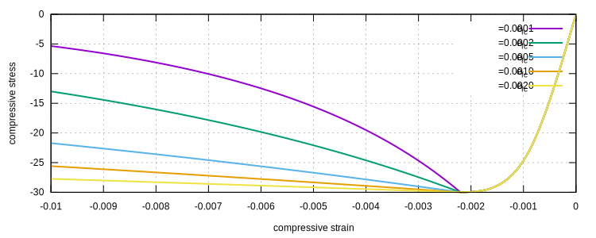
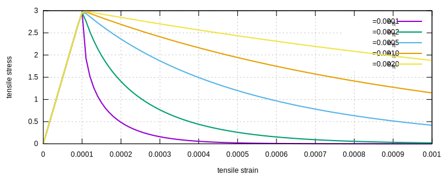
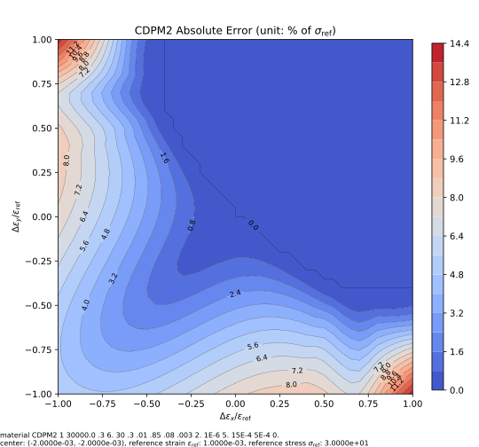
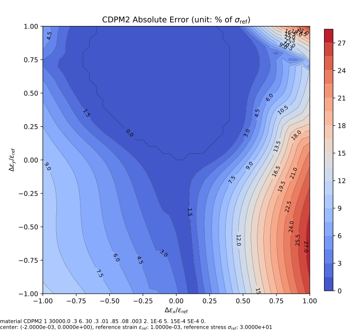

# CDPM2

CDPM2 Model for Concrete Material

## References

1. [10.1016/j.ijsolstr.2013.07.008](https://doi.org/10.1016/j.ijsolstr.2013.07.008)
2. [10.1016/j.ijsolstr.2005.05.038](https://doi.org/10.1016/j.ijsolstr.2005.05.038)

## Syntax

```text
material CDPM2 (1) [2-16]
material CDPM2ISO (1) [2-16]
material CDPM2ANISO (1) [2-16]
# (1) int, unique material tag
# [2] double, elastic modulus, default: 3E4
# [3] double, poissons ratio, default: 0.3
# [4] double, tension strength (positive), default: 3.0
# [5] double, compression strength (positive), default: 30.0
# [6] double, q_h0, initial hardening factor, default: 0.3
# [7] double, h_p hardening ratio, default: .01
# [8] double, d_f, default: .85
# [9] double, a_h, hardening related parameter, default: 0.08
# [10] double, b_h, hardening related parameter, default: 0.003
# [11] double, c_h, hardening related parameter, default: 2.0
# [12] double, d_h, hardening related parameter, default: 1E-6
# [13] double, a_s, ductility related parameter, default: 5.0
# [14] double, e_ft, tension softening parameter, default: 5E-4
# [15] double, e_fc, compression softening parameter, default: 5E-4
# [16] double, density, default: 0.0
```

## Remarks

1. The isotropic damage is implemented.
2. The anisotropic damage is implemented.
3. For detailed explanations of parameters, please refer
   to [10.1016/j.ijsolstr.2013.07.008](https://doi.org/10.1016/j.ijsolstr.2013.07.008).
4. The default `CDPM2` uses isotropic damage, which is equivalent to `CDPM2ISO`.
5. The token `CDPM2ANISO` uses anisotropic damage.
6. If damage is activated, both tension and compression use the exponential damage model, the degradation is controlled
   by parameters [14] and [15]. The characteristic length can be accounted for by modifying them.

Details of implementation can be seen in the corresponding section
in [Constitutive Modelling Cookbook](https://github.com/TLCFEM/constitutive-modelling-cookbook/releases/download/latest/COOKBOOK.pdf).

## Recording

This model supports the following additional history variables to be recorded.

| variable label | physical meaning              |
|----------------|-------------------------------|
| DT             | tensile damage                |
| DC             | compressive damage            |

## Examples

The isotropic damage uses the following expression for the final stress $$\mathbf{\sigma}$$,

$$
\mathbf{\sigma}=(1-\omega_c)(1-\omega_t)\mathbf{\bar{\sigma}}.
$$

The anisotropic damage uses the following expression,

$$
\mathbf{\sigma}=(1-\omega_c)\mathbf{\bar{\sigma}}_c+(1-\omega_t)\mathbf{\bar{\sigma}}_t.
$$

In the above expressions, $$\mathbf{\bar{\sigma}}$$ is the effective stress (undamaged),
$$\mathbf{\bar{\sigma}}_c$$ and $$\mathbf{\bar{\sigma}}_t$$ are compressive and tensile part of the effective stress.
They are computed via eigen decomposition of the effective stress tensor.
$$\omega_c$$ and $$\omega_t$$ are the compressive and tensile damage variables, respectively.

Both damage types have physical implications.
Depending on the damage type, the model parameters may be adjusted differently.

The reference strains $$e_{ft}$$ and $$e_{fc}$$ affect the degradation of strength.

The following are two examples, using different values of $$e_{ft}$$ and $$e_{fc}$$,
while all other parameters are the default values.





## Iso-error Map

The following example iso-error maps are obtained via the following script.

```py
from plugins import ErrorMap
# note: the dependency `ErrorMap` can be found in the following link
# https://github.com/TLCFEM/suanPan-manual/blob/dev/plugins/scripts/ErrorMap.py

young_modulus = 3e4
yield_stress = 30

with ErrorMap(
   f"material CDPM2 1 {young_modulus} .3 6. {yield_stress} .3 .01 .85 .08 .003 2. 1E-6 5. 15E-4 5E-4",
   ref_strain=yield_stress / young_modulus,
   ref_stress=yield_stress,
   contour_samples=20,
) as error_map:
   error_map.contour("cdpm2.uniaxial", center=(-2, -2), size=1)
   error_map.contour("cdpm2.biaxial", center=(-2, 0), size=1)
```



