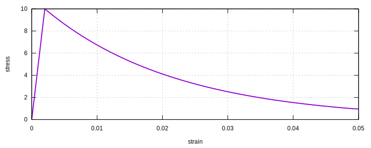
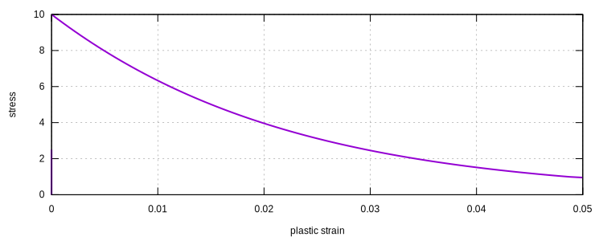
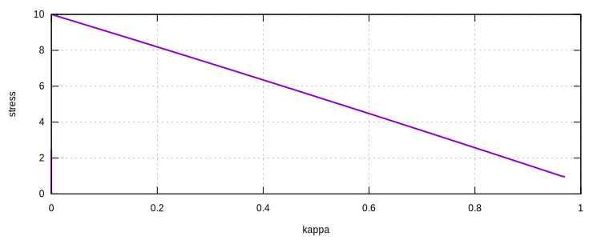

# CustomCDP

The CDP Model With Custom Backbones

The formulation is identical to that of the `CDP` model.

User should provide the backbones and damage evolutions via expressions.

## Syntax

```text
material CustomCDP (1) (2) (3) (4) (5) (6) (7) [8] [9] [10] [11]
# (1) int, unique material tag
# (2) int, tension expression tag
# (3) int, compression expression tag
# (4) double, elastic modulus
# (5) double, poisson's ratio
# (6) double, normalized crack energy (+)
# (7) double, normalized crush energy (+)
# [8] double, dilatancy parameter, default: 0.2
# [9] double, biaxial compression strength ratio, default: 1.16
# [10] double, stiffness recovery ratio, default: 0.5
# [11] double, density, default: 0
```

## Restrictions

1. The expressions should take one input argument, the damage variable, $$\kappa$$.
   The $$\kappa$$ is different from the degradation denoted as $$d$$.
   The output should have a size of six.
2. The normalized energy should be provided, which is used to generate objective results.
   It is typically around the size of the area under the curve.
3. The output consists of six components, which are explained in the following.

The expression shall generate six numbers based on the input $$\kappa$$:

| Index |         Symbol         | Description                    |
|:-----:|:----------------------:|:-------------------------------|
|   1   |         $$d$$          | damage degradation index       |
|   2   |         $$f$$          | final stress: $$(1-d)\bar{f}$$ |
|   3   |      $$\bar{f}$$       | effective stress $$f/(1-d)$$   |
|   4   |    $$\mathrm{d}~d$$    | derivative of $$d$$            |
|   5   |    $$\mathrm{d}~f$$    | derivative of $$f$$            |
|   6   | $$\mathrm{d}~\bar{f}$$ | derivative of $$\bar{f}$$      |

The $$\kappa$$ ranges from 0 to 1.

The damage degradation index $$d$$ shall satisfy: $$d(0)=0$$ and $$d(1)=1$$.

The $$f$$ is the actual stress observed as the final output of the model.

By following these rules imposed, users can implement any custom backbone and damage evolution.

Further explanation of the curves can be seen in
[10.1061/(ASCE)0733-9399(1998)124:8(892)](https://doi.org/10.1061/(ASCE)0733-9399(1998)124:8(892))

## Example

For the porpose of illustration, we provide a simple example, which may not be applicable to real concrete behaviour.

Let's, say for example, the damage degradation is a linear function of $$\kappa$$, that is

$$
d(\kappa)=\kappa,
$$

so that $$d(0)=0$$ and $$d(1)=1$$.

Assume the effective stess is a constant, say $$\bar{f}=10$$. The stress is then

$$
f=\bar{f}(1-d)=10(1-\kappa).
$$

One can define an expression as follows:

```text
expression SimpleVector 1 x y|6 example
```

where $$x$$ maps to $$\kappa$$ and $$y$$ maps to the six components of the output.

The text file `example` contains the following:

```text
y[0]:=x;
y[1]:=10*(1-x);
y[2]:=10;
y[3]:=1;
y[4]:=-10;
y[5]:=0;
```

Then it can be used in a `CustomCDP` material model such that:

```text
# A TEST MODEL FOR CUSTOMCDP MATERIAL

node 1 5 -5 0
node 2 5 5 0
node 3 -5 5 0
node 4 -5 -5 0
node 5 5 -5 10
node 6 5 5 10
node 7 -5 5 10
node 8 -5 -5 10
node 9 5 -5 20
node 10 5 5 20
node 11 -5 5 20
node 12 -5 -5 20

expression SimpleVector 1 x y|6 example

material CustomCDP 1 1 1 5000 .2 2E-1 2E-1 .23 1.16 .4 2400E-12

element C3D8 1 1 2 3 4 5 6 7 8 1 G
element C3D8 2 5 6 7 8 9 10 11 12 1 G

hdf5recorder 1 Element E33 1
hdf5recorder 2 Element S33 1
hdf5recorder 3 Element KAPPAT 1

fix 1 1 1 2 5 6 9 10
fix 2 2 1 4 5 8 9 12
fix 3 3 1 2 3 4

displacement 1 0 1 3 9 10 11 12

step static 1
set fixed_step_size 1
set ini_step_size 1E-2
set symm_mat 0

converger RelIncreDisp 1 1E-9 10 1

analyze

save recorder 1 2 3

exit
```

One can plot the strain-stress curve.



The plastic strain can be computed as

$$
\varepsilon_p=\varepsilon-\frac{\sigma}{E}
$$

The curve can be plotted as



The $$\kappa$$ is the accumulated area under the plastic strain-stress curve over the given $$g$$, in this example,
$$g=0.2$$.

$$
\kappa=\dfrac{1}{g}\int_0^{\varepsilon_p^*}\sigma{}d\varepsilon_p
$$

The $$\kappa$$-$$\sigma$$ curve can be processed as


