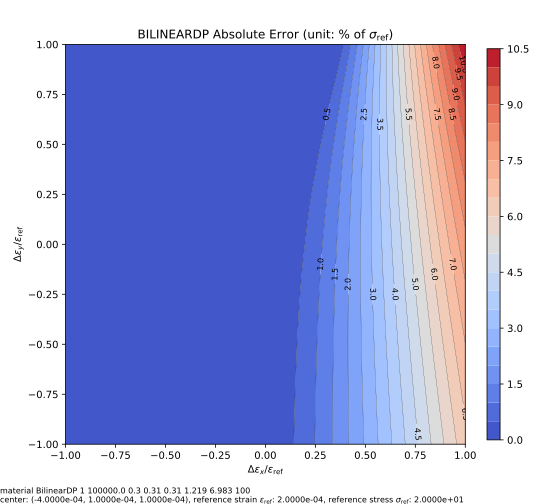

# BilinearDP

Bilinear Drucker-Prager Model

## Syntax

```
material BilinearDP (1) (2) (3) (4) (5) (6) (7) (8) [9]
# (1) int, unique material tag
# (2) double, elastic modulus
# (3) double, poissons ratio
# (4) double, \eta_y
# (5) double, \eta_f
# (6) double, \xi
# (7) double, initial cohesion, c_0
# (8) double, hardening ratio/modulus, H
# [9] double, density, default: 0.0
```

## Theory

See more details on the formulation in the parent [page](NonlinearDruckerPrager.md).

### Hardening Function

The cohesion develops linearly with the accumulated plastic strain,

$$
c=c_0+H\bar{\varepsilon_p},
$$

in which $$c_0$$ is the initial cohesion (similar to the initial yield stress), $$H$$ is the hardening modulus, and $$\bar{\varepsilon_p}$$ is the accumulated plastic strain.

### More

If one sets $$\eta_y=\eta_f=0$$, the model effectively becomes the von Mises model with the associative plasticity.
In a uniaxial loading case, the yield function is then

$$
F(\sigma,c)=\sigma-\sqrt{3}\xi{}c.
$$

This leads to a yield stress $$\sigma_y=\sqrt{3}\xi{}c_0$$.
The plastic hardening modulus is $$3\xi^2H$$.
In terms of total strain and stress, the hardening ratio is $$3\xi^2H/(E+3\xi^2H)$$.

For the following model, one can compute the hardening ratio to be

$$
\dfrac{3\xi^2H}{E+3\xi^2H}=0.06204607451.
$$

One can validate this value by plotting the response.

```text
node 1 5 -5 -5
node 2 5 5 -5
node 3 -5 5 -5
node 4 -5 -5 -5
node 5 5 -5 5
node 6 5 5 5
node 7 -5 5 5
node 8 -5 -5 5

material BilinearDP 1 1E4 .3 0 0 .58461851886189 5 645.1584849161

element C3D8 1 1 2 3 4 5 6 7 8 1

fix 1 1 1 2 5 6
fix 2 2 1 4 5 8
fix 3 3 1 2 3 4

displacement 1 0 -.2 3 5 6 7 8

hdf5recorder 1 Element E 1
hdf5recorder 2 Element S 1

step static 1
set fixed_step_size 1
set ini_step_size 1E-2
set symm_mat 0

analyze

save recorder 1 2

exit
```

## Iso-error Map

The following example iso-error maps are obtained via the following script.

```py
from plugins import ErrorMap
# note: the dependency `ErrorMap` can be found in the following link
# https://github.com/TLCFEM/suanPan-manual/blob/dev/plugins/scripts/ErrorMap.py

young_modulus = 1e5
ref_stress = 20

with ErrorMap(
    f"material BilinearDP 1 {young_modulus} 0.3 0.31 0.31 1.219 6.983 100",
    ref_strain=ref_stress / young_modulus,
    ref_stress=ref_stress,
    contour_samples=20,
) as error_map:
    error_map.contour("dp.uniaxial", center=(-2, 0.5, 0.5), size=1)
```


