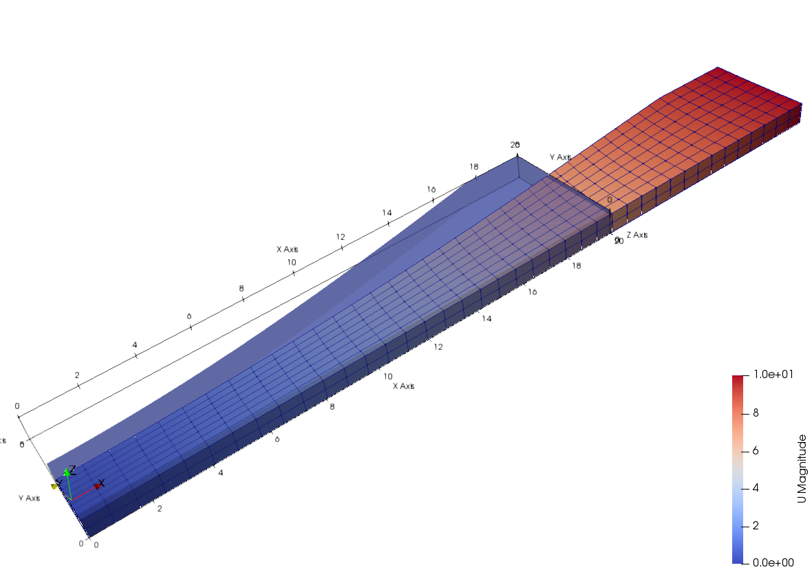

# MooneyRivlin

Mooney-Rivlin Rubber Material

The regularized Mooney-Rivlin material for compressible rubbers uses the following expression to measure strain energy.

$$
W=A_{10}(J_1-3)+A_{01}(J_2-3)+\dfrac{K}{2}(J_3-1)^2,
$$

where $$A_{10}$$ and $$A_{01}$$ are two material constants and $$K$$ is the bulk modulus.

## Syntax

```
material MoonetRivlin (1) (2) (3) (4) [5]
# (1) int, unique tag
# (2) double, bulk modulus
# (3) double, A_{10}
# (4) double, A_{01}
# [5] double, density, default: 0.0
```

## Remarks

1. Nonlinear geometry switch shall be turned on in related elements.
2. The model takes the Green strain as input. To implement any elements that incorporate this material model, the Green
   strain in Voigt notation shall be passed as strain input.

## Usage


