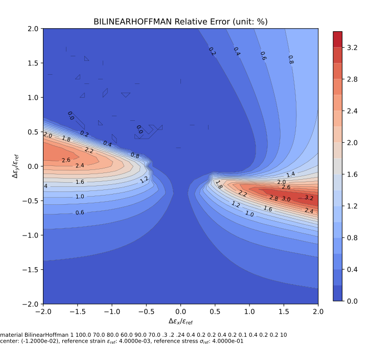

# BilinearHoffman

Bilinear Hardening Hoffman Model

## Syntax

```
material BilinearHoffman (1) (2...7) (8...10) (11...19) [20] [21]
# (1) int, unique material tag
# (2...7) double, six moduli: E_{xx}, E_{yy}, E_{zz}, E_{xy}, E_{yz}, E_{zx}
# (8...10) double, three poissions ratios: v_{xy}, v_{yz}, v_{zx}
# (11...19) double, nine yield stress
# [20] double, hardening ratio, default: 0.0
# [21] double, density, default: 0.0
```

## Iso-error Map

The following example iso-error maps are obtained via the following script.

```py
from plugins import ErrorMap
# note: the dependency `ErrorMap` can be found in the following link
# https://github.com/TLCFEM/suanPan-manual/blob/dev/plugins/scripts/ErrorMap.py

modulus = 1e2
yield_stress = 0.4

with ErrorMap(
    f"material BilinearHoffman 1 {modulus} {0.7 * modulus} {0.8 * modulus} {0.6 * modulus} {0.9 * modulus} {0.7 * modulus} .3 .2 .24 {yield_stress} {0.5 * yield_stress} {0.5 * yield_stress} {yield_stress} {0.5 * yield_stress} {0.25 * yield_stress} {yield_stress} {0.5 * yield_stress} {0.5 * yield_stress} 10",
    ref_strain=yield_stress / modulus,
    ref_stress=yield_stress,
    contour_samples=30,
) as error_map:
    error_map.contour("bilinear.hoffman.uniaxial", center=(-3, 0), size=2, type={"rel", "abs"})
    error_map.contour("bilinear.hoffman.biaxial", center=(-3, -3), size=2, type={"rel", "abs"})
```




