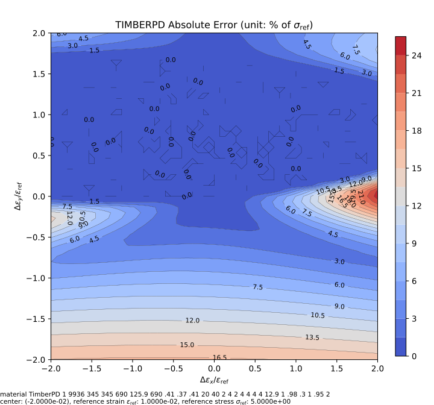
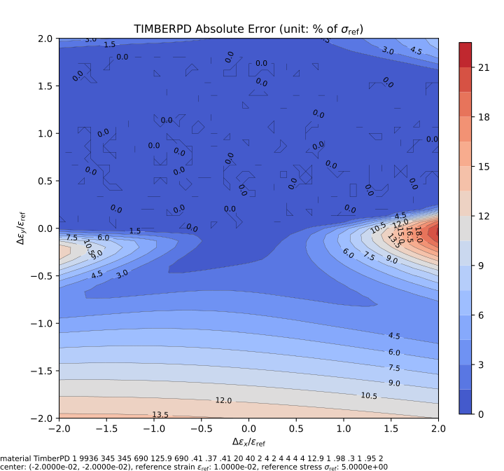
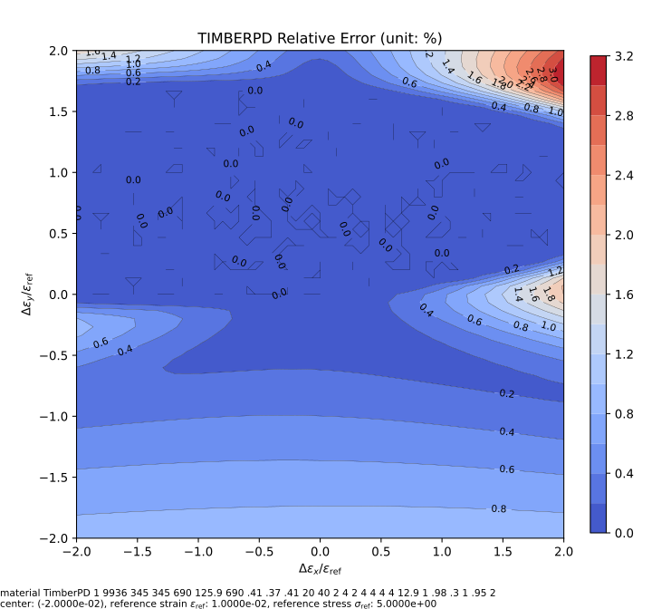
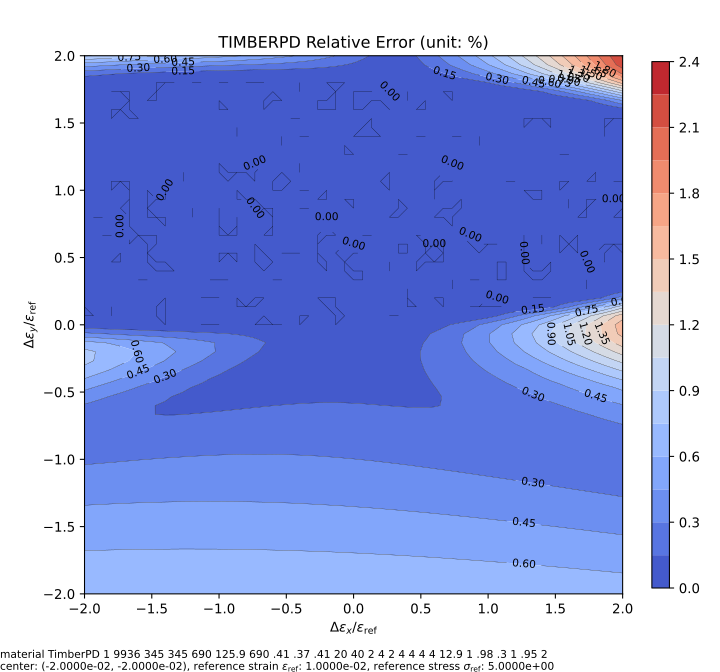

# TimberPD

Timber Plastic-Damage Model

## References

1. [Constitutive Modelling Cookbook](https://github.com/TLCFEM/constitutive-modelling-cookbook/releases/download/latest/COOKBOOK.pdf)
2. [10.1016/j.compstruc.2017.09.010](https://doi.org/10.1016/j.compstruc.2017.09.010)

## Syntax

```
material TimberPD (1) (2...7) (8...10) (11...19) (20) (21) (22) (23) (24) (25) (26) [27]
# (1) int, unique material tag
# (2...7) double, six moduli: E_{xx}, E_{yy}, E_{zz}, G_{xy}, G_{yz}, G_{zx}
# (8...10) double, three poissions ratios: v_{xy}, v_{yz}, v_{xz}
# (11...19) double, nine yield stress
# (20) double, h
# (21) double, r_t^0
# (22) double, b_t, [0,1]
# (23) double, m_t
# (24) double, r_c^0
# (25) double, b_c, [0,1]
# (26) double, m_c
# [27] double, density, default: 0.0
```

## Remarks

1. The yield stress shall be arranged in the following order: $$\sigma_{11}^t$$, $$\sigma_{11}^c$$, $$\sigma_{22}^t$$,
    $$\sigma_{22}^c$$, $$\sigma_{33}^t$$, $$\sigma_{33}^c$$, $$\sigma_{12}^0$$, $$\sigma_{23}^0$$, $$\sigma_{13}^0$$.
2. The original paper documents a comprehensive procedure to determine hardening parameter $$h$$.

## Damage

The damage evolutions are identical to the original formulation but with different notations.

The final stress $$\sigma$$ is calculated as

$$
\sigma=\left(1-\omega_t\right)\bar{\sigma}_t+\left(1-\omega_c\right)\bar{\sigma}_c
$$

### Tension Damage Evolution

$$
\omega_t=1-\dfrac{r_t^0}{r_t}\left(1-b_t+b_t\exp\left(m_t\left(r_t^0-r_t\right)\right)\right)
$$

The parameter $$b_t$$ will be clamped to $$0\leq{}b_t\leq1$$.

### Compression Damage Evolution

$$
\omega_c=b_c\left(1-\dfrac{r_c^0}{r_c}\right)^{m_c}
$$

The parameter $$b_c$$ will be clamped to $$0\leq{}b_c\leq1$$.

View and edit parameters to see how they affect the damage evolution.

<p style="text-align:center"><iframe src="https://www.desmos.com/calculator/erkilecav8?embed" width="800" height="400" style="border: 1px solid #ccc" frameborder=0></iframe></p>

## Iso-error Map

The following example iso-error maps are obtained via the following script.

```py
from plugins import ErrorMap
# note: the dependency `ErrorMap` can be found in the following link
# https://github.com/TLCFEM/suanPan-manual/blob/dev/plugins/scripts/ErrorMap.py

with ErrorMap(
    """material TimberPD 1 \
9936 345 345 690 125.9 690 \
.41 .37 .41 \
20 40 2 4 2 4 4 4 4 \
12.9 \
1 .98 .3 \
1 .95 2""",
    ref_strain=1e-2,
    ref_stress=5,
    contour_samples=30,
) as error_map:
    error_map.contour("timberpd.uniaxial", center=(-2, 0), size=2, type={"rel", "abs"})
    error_map.contour("timberpd.biaxial", center=(-2, -2), size=2, type={"rel", "abs"})
```





