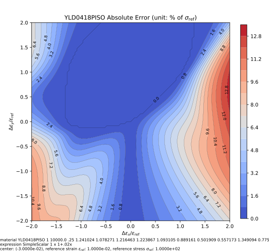
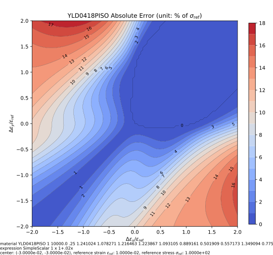
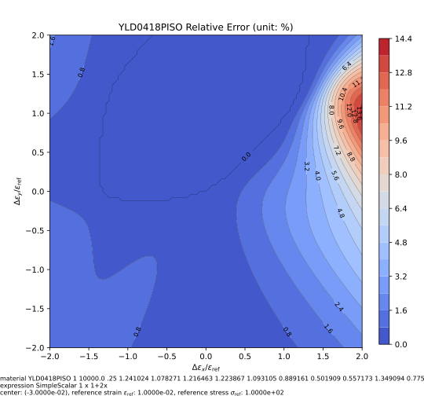
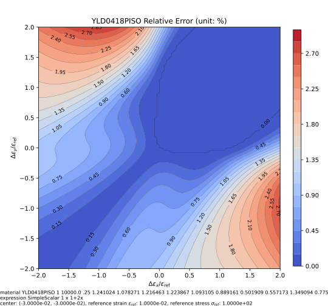

# YLD0418P

The `YLD0418P` material implements an isotropic hardening model using the YLD2004-18P yield criterion with either orthotropic or isotropic elasticity.

## References

1. [10.1016/j.ijplas.2004.06.004](https://doi.org/10.1016/j.ijplas.2004.06.004)

## Syntax

### Orthotropic Elasticity

```
material YLD0418P (1) (2...7) (8...10) (11...28) (29) (30) (31) [32]
# (1) int, unique material tag
# (2...7) double, six moduli: E_{xx}, E_{yy}, E_{zz}, G_{xy}, G_{yz}, G_{zx}
# (8...10) double, three poissions ratios: v_{xy}, v_{yz}, v_{xz}
# (11...28) double, 18 model parameters, see documentation for details
# (29) double, exponent
# (30) double, reference stress
# (31) int, hardening backbone expression tag
# [32] double, density, default: 0.0
```

### Isotropic Elasticity

```
material YLD0418PISO (1) (2) (3) (4...21) (22) (23) (24) [25]
# (1) int, unique material tag
# (2) double, elastic modulus
# (3) double, poissions ratio
# (4...21) double, 18 model parameters, see documentation for details
# (22) double, exponent
# (23) double, reference stress
# (24) int, hardening backbone expression tag
# [25] double, density, default: 0.0
```

## Remarks

The hardening expression shall be a **simple scalar-valued** expression.
Check the corresponding [page](../../../../Collection/Define/expression.md) for details.

## Example

```
expression SimpleScalar 1 x 1+.02x

material YLD0418PISO 1 1E4 .25 \
1.241024 1.078271 1.216463 1.223867 1.093105 0.889161 0.501909 0.557173 1.349094 \
0.775366 0.922743 0.765487 0.793356 0.918689 1.027625 1.115833 1.112273 0.589787 \
8 100. \
1
```

## Iso-error Map

The following example iso-error maps are obtained via the following script.

```py
from plugins import ErrorMap
# note: the dependency `ErrorMap` can be found in the following link
# https://github.com/TLCFEM/suanPan-manual/blob/dev/plugins/scripts/ErrorMap.py

modulus = 1e4
yield_stress = 100.0

with ErrorMap(
    f"material YLD0418PISO 1 {modulus} .25 \
1.241024 1.078271 1.216463 1.223867 1.093105 0.889161 0.501909 0.557173 1.349094 \
0.775366 0.922743 0.765487 0.793356 0.918689 1.027625 1.115833 1.112273 0.589787 \
8 {yield_stress} \
1\nexpression SimpleScalar 1 x 1+2x",
    ref_strain=yield_stress / modulus,
    ref_stress=yield_stress,
    contour_samples=50,
) as error_map:
    error_map.contour(
        "yld0418piso.uniaxial", center=(-3, 0), size=2, type={"rel", "abs"}
    )
    error_map.contour(
        "yld0418piso.biaxial", center=(-3, -3), size=2, type={"rel", "abs"}
    )
```





