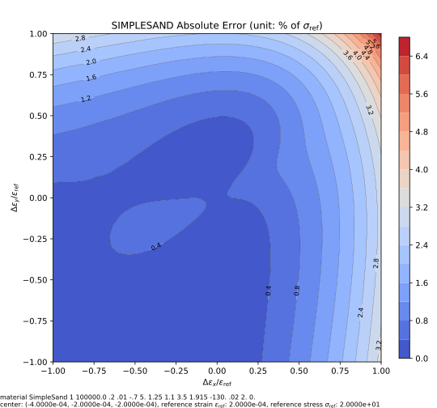

# SimpleSand

A Simple Sand Model

The continuum mechanics based sign convention (tension is positive) is used for consistency.

The `SimpleSand` model is a simple sand hardening model that adopts a bounding surface concept.

Readers can also refer to the corresponding section
in [Constitutive Modelling Cookbook](https://github.com/TLCFEM/constitutive-modelling-cookbook/releases/download/latest/COOKBOOK.pdf)
for details on the theory.

## Syntax

```
material SimpleSand (1) (2) (3) (4) (5) (6) (7) (8) (9) (10) (11) (12) (13) [14]
# (1) int, unique material tag
# (2) double, elastic modulus
# (3) double, poissons ratio
# (4) double, m, size of yield surface
# (5) double, A, dilatancy related parameter, often negative
# (6) double, h, dilatancy related hardening parameter
# (7) double, alpha_c, critical alpha
# (8) double, n_b, bounding surface evolution parameter
# (9) double, n_d, dilatancy surface evolution parameter
# (10) double, v_c, critical specific volume
# (11) double, p_c, critical hydrostatic stress, should be negative
# (12) double, lambda_c, the slope of critical state line
# (13) double, v_0, initial specific volume
# [14] double, density, default: 0.0
```

## Theory

### Critical State

The state parameter is defined as

$$
\psi=v-v_c+\lambda_c\ln\left(\dfrac{p}{p_c}\right)
$$

The specific volume can be expressed in terms of strain,

$$
v=v_0\left(1+\mathrm{tr}~\varepsilon\right).
$$

Thus, the bounding surface and dilatancy surface can be defined to evolve with $$\psi$$,

$$
\alpha^b=\alpha^c\exp\left(-n^b\psi\right),\qquad \alpha^d=\alpha^c\exp\left(n^d\psi\right),
$$

where $$\alpha^c$$ is the initial size of surfaces.

### Yield Surface

The following wedge-like function is chosen to be the yield surface,

$$
F=|s+p\alpha|+mp,
$$

where $$s$$ is the deviatoric stress, $$p$$ is the hydrostatic stress, $$\alpha$$ is the back stress ratio and $$m$$ is
a constant that controls the size of the wedge.

### Flow Rule

A non-associated flow rule is defined.

$$
\Delta\varepsilon^p=\Delta\gamma{}\left(n+\dfrac{1}{3}DI\right),
$$

where $$n=\dfrac{s+p\alpha}{|s+p\alpha|}$$ is a unit tensor, $$I$$ is the second order unit tensor and $$D=A\left(
\alpha^d-\alpha:n\right)$$ is the dilatancy parameter.

Note due to the change of sign convention, a negative $$D$$ leads to contractive response, thus $$A$$ often needs to be
negative.

### Hardening Rule

The evolution of $$\alpha$$ is similar to the Armstrong-Frederick hardening law.

$$
\Delta\alpha=\Delta\gamma{}h\left(\alpha^bn-\alpha\right),
$$

where $$h$$ is a constant that controls the speed of hardening.

## Example

Please refer to [triaxial-compression-of-sand](../../../../Example/Geotechnical/triaxial-compression-of-sand.md).

## Iso-error Map

The following example iso-error maps are obtained via the following script.

```py
from plugins import ErrorMap
# note: the dependency `ErrorMap` can be found in the following link
# https://github.com/TLCFEM/suanPan-manual/blob/dev/plugins/scripts/ErrorMap.py

young_modulus = 1e5
ref_stress = 20

with ErrorMap(
    f"material SimpleSand 1 {young_modulus} .2 .01 -.7 5. 1.25 1.1 3.5 1.915 -130. .02 2. 0.",
    ref_strain=ref_stress / young_modulus,
    ref_stress=ref_stress,
    contour_samples=30,
) as error_map:
    error_map.contour("simple.sand.uniaxial", center=(-2, -1, -1), size=1)
```


