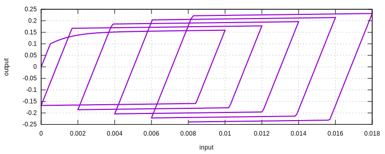
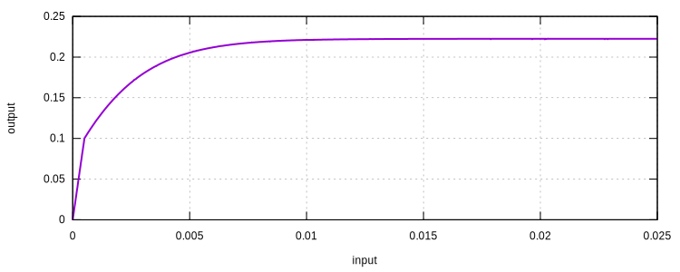
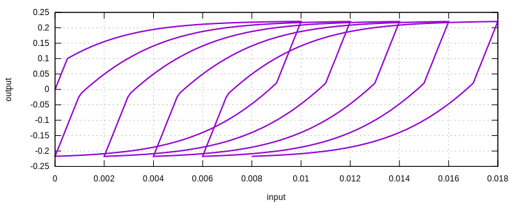
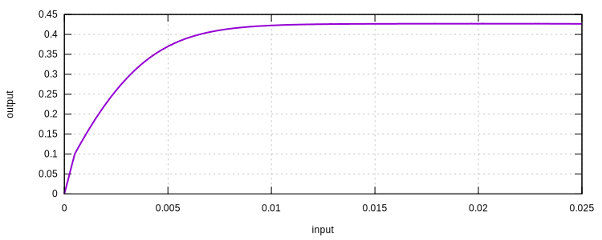
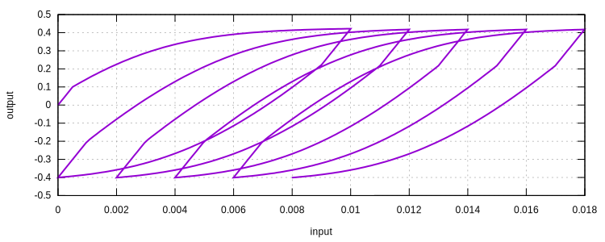
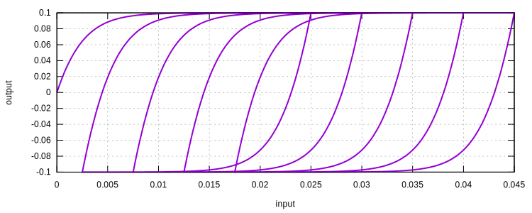
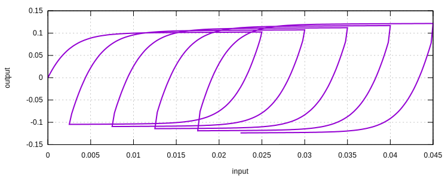

# ArmstrongFrederick

Armstrong-Frederick Steel Model

## References

1. [10.1016/S0749-6419(01)00049-3](https://doi.org/10.1016/S0749-6419(01)00049-3)
2. [10.1115/1.3264257](https://doi.org/10.1115/1.3264257)
3. [10.1179/096034007X207589](https://doi.org/10.1179/096034007X207589)

## Theory

Implementation can be found in a separate [document](ArmstrongFrederick.pdf).

A von Mises type yield function is used. The associated plasticity is assumed. Both isotropic and kinematic hardening
rules are employed.

Although the plastic flow is associative, the hardening rules are not. As the result, the consistent tangent modulus is
not symmetric.

### Isotropic Hardening

An exponential function is added to the linear hardening law.

$$
k=\sigma_y+k_s(1-e^{-mp})+k_lp,
$$

where $$\sigma_y$$ is the initial elastic limit (yielding stress), $$k_s$$ is the saturated stress, $$k_l$$ is the
linear hardening modulus, $$m$$ is a constant that controls the speed of hardening,
$$\mathrm{d}p=\sqrt{\dfrac{2}{3}\mathrm{d}\varepsilon^p:\mathrm{d}\varepsilon^p}$$ is the rate of accumulated plastic
strain $$p$$.

### Kinematic Hardening

The Armstrong-Frederick type rule is used. Multiple back stresses are defined,

$$
\beta=\sum\beta^i
$$

in which

$$
\mathrm{d}\beta^i=\sqrt{\dfrac{2}{3}}a^i~\mathrm{d}\varepsilon^p-b^i\beta~\mathrm{d}p,
$$

where $$a^i$$ and $$b^i$$ are material constants. Note here a slightly different definition is adopted as in the
original literature $$\dfrac{2}{3}$$ is used instead of $$\sqrt{\dfrac{2}{3}}$$. This is purely for a slightly more tidy
derivation and does not affect anything.

## Syntax

```
material ArmstrongFrederick (1) (2) (3) (4) (5) (6) (7) [(8) (9)...] [10]
# (1) int, unique material tag
# (2) double, elastic modulus
# (3) double, poissons ratio
# (4) double, yield stress
# (5) double, saturated stress
# (6) double, linear hardening modulus
# (7) double, m
# (8) double, a
# (9) double, b
# [10] double, density, default: 0.0
```

## History Layout

| location                | parameter                                                         |
|-------------------------|-------------------------------------------------------------------|
| `initial_history(0)`    | accumulated plastic strain                                        |
| `initial_history(1-6)`  | back stress for the first pair of $$a^1$$ and $$b^1$$             |
| `initial_history(7-12)` | back stress for the second pair of $$a^2$$ and $$b^2$$ if defined |
| ...                     | more back stresses                                                |

## Example

Here a few examples are shown.

### Isotropic Hardening Only

There is no difference between the classic J2 plasticity model and this AF steel model if only isotropic hardening is
defined.

```
material ArmstrongFrederick 1 2E2 .2 .1 .05 1. 1000.
```



### Kinematic Hardening Only

If $$a\neq0$$ and $$b=0$$, there is no difference between the classic J2 plasticity model and this AF steel model. A
linear kinematic hardening rule is implied. Normally at least one set of $$a^1$$ and $$b^1$$ is defined.

```
material ArmstrongFrederick 1 2E2 .2 .1 0. 0. 0. 50. 500.
```



By definition, if one set of $$a^1$$ and $$b^1$$ is defined, then the maximum stress can be computed as

$$
\sigma_{max}=\sigma_y+\sqrt{\dfrac{3}{2}}\dfrac{a^1}{b^1}.
$$

In this case, it is

$$
\sigma_{max}=0.1~\mathrm{GPa}+\sqrt{\dfrac{3}{2}}\dfrac{50}{500}~\mathrm{GPa}=222.47~\mathrm{MPa}.
$$

The cyclic response is shown as follows.



Of course, multiple sets of $$a^i$$ and $$b^i$$ can be defined.

```
material ArmstrongFrederick 1 2E2 .2 .1 0. 0. 0. 50. 500. 100. 600.
```

Accordingly, the maximum stress is

$$
\sigma_{max}=\sigma_y+\sqrt{\dfrac{3}{2}}\sum\dfrac{a^i}{b^i}=0.1+\sqrt{\dfrac{3}{2}}\left(
\dfrac{50}{500}+\dfrac{100}{600}\right)=426.60~\mathrm{MPa}.
$$



The cyclic response is shown as follows.



### Zero Elastic Range

It is possible to define a zero plastic range response, although the initial stiffness cannot be explicitly assigned.

```
material ArmstrongFrederick 1 2E2 .2 0. 0. 0. 0. 40.82482305 500.
```

The corresponding maximum stress is $$100~\mathrm{MPa}$$.



With some linear isotropic hardening,

```
material ArmstrongFrederick 1 2E2 .2 0. 0. .1 0. 40.82482305 500.
```


