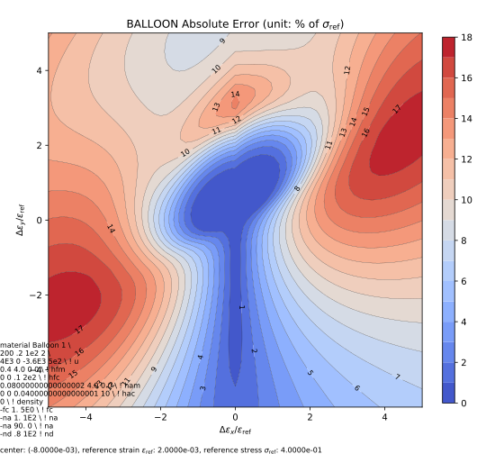
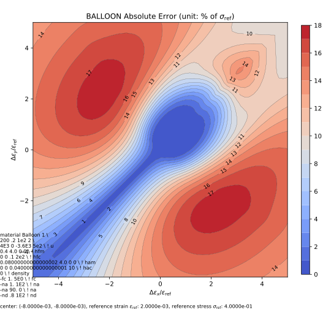
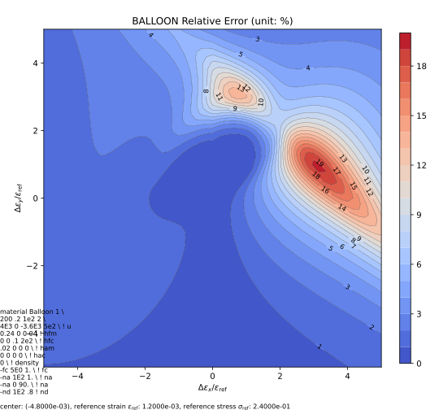
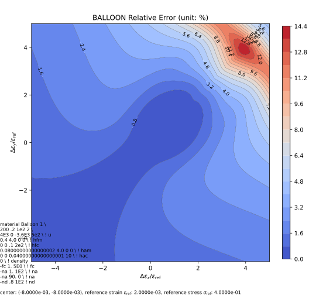

# Balloon

Balloon Model

The Balloon-v1 model is an advanced model for metals with enhanced cyclic behaviour.

Both this model and [Balloon1D](../../Material1D/vonMises/Balloon1D.md) share the same definitions of parameters.
Both models shall yield the same uniaxial behaviour if the same parameter set is used.

## References

1. [10.31224/6937](https://doi.org/10.31224/6937)

## Syntax

```text
material Balloon ${1:(1)} ${2:(2)} ${3:(3)} ${4:(4)} ${5:(5)} ${6:(6 7 8 9)} ${7:(10 11 12 13)} ${8:(14 15 16 17)} ${9:(18 19 20 21)} ${10:(22 23 24 25)} ${11:(26)} ${12:[(27) (28) (29)...]}
# (1) int, unique material tag
# (2) double, elastic modulus
# (3) double, poisson's ratio
# (4) double, k_r
# (5) double, load reversal memory size
# (6 7 8 9) double, u bound, initial, linear, saturation, rate
# (10 11 12 13) double, fm bound, initial, linear, saturation, rate
# (14 15 16 17) double, fc bound, initial, linear, saturation, rate
# (18 19 20 21) double, am bound, initial, linear, saturation, rate
# (22 23 24 25) double, ac bound, initial, linear, saturation, rate
# (26) double, density
# (27) string, token, one of '-fc', '-ac', '-na', '-nd'
# (28 29) double, saturation, rate
```

## Theory

### Bound Function

The scalar bounds use the following general form.

$$
\chi\left(q\right)=\chi_0+kq+\chi_s\left(1-\exp\left(-rq\right)\right).
$$

In which $$q$$ is the proper accumulated plastic strain.
Effectively, it has three parts: 1) initial value $$\chi_0$$, 2) linear part $$kq$$ and 3) saturation part $$\chi_s\left(1-\exp\left(-rq\right)\right)$$.
The parameter tuple takes $$\chi_0$$, $$k$$, $$\chi_s$$ and $$r$$.

### Cyclic Evolution

The key-value tuples indicated by tokens '-fc' and '-ac' control the evolutions of cyclic bounds (scalars).
The key-value tuples indicated by tokens '-na' and '-nd'  control the evolutions of back stress like quantities (tensors).
For all four sets, the Armstrong-Fredrick style exponential rule is used, and two parameters indicator the saturation target and the corresponding saturation rate.

Typically, the saturation value can be fixed to unity such that those quantities saturation to unity (either scalar or tensor) as the actual magnitudes need to account for the previous bounds.
For the same quantity, more than one tuple can be defined.
For example, `-fc .4 100 -fc .6 200` means there are two components, one saturates to 0.4 with a rate of 100 and the other saturates to 0.6 with a rate of 200.
The two parts are summed up so $$F_c$$ will eventually saturate to 1.0.

## Iso-error Map

The Balloon-v1 model extends the subloading surface model and behaves in a similar way under monotonic loading.
The iso-error maps are thus similar to that of the subloading surface model.

The following example iso-error maps are obtained via the following script.

```py
from plugins import ErrorMap

# note: the dependency `ErrorMap` can be found in the following link
# https://github.com/TLCFEM/suanPan-manual/blob/dev/plugins/scripts/ErrorMap.py

young_modulus = 200
yield_stress = .4

with ErrorMap(
        fr'''
material Balloon 1 \
{young_modulus} .2 1e2 2 \
4E3 0 -3.6E3 5e2 \ ! u
{yield_stress} {.02 * young_modulus} 0 0 \ ! hfm
0 0 .1 2e2 \ ! hfc
{.2 * yield_stress} {.02 * young_modulus} 0 0 \ ! ham
0 0 {.1 * yield_stress} 10 \ ! hac
0 \ ! density
-fc 1. 5E0 \ ! fc
-na 1. 1E2 \ ! na
-na 90. 0 \ ! na
-nd .8 1E2 ! nd
''',
        ref_strain=yield_stress / young_modulus,
        ref_stress=yield_stress,
        contour_samples=30,
) as error_map:
    error_map.contour("balloon.uniaxial", center=(-4, 0), size=5, type={"rel", "abs"})
    error_map.contour("balloon.biaxial", center=(-4, -4), size=5, type={"rel", "abs"})
```






## Examples

See the [demo](Balloon.Demo.md) page.
