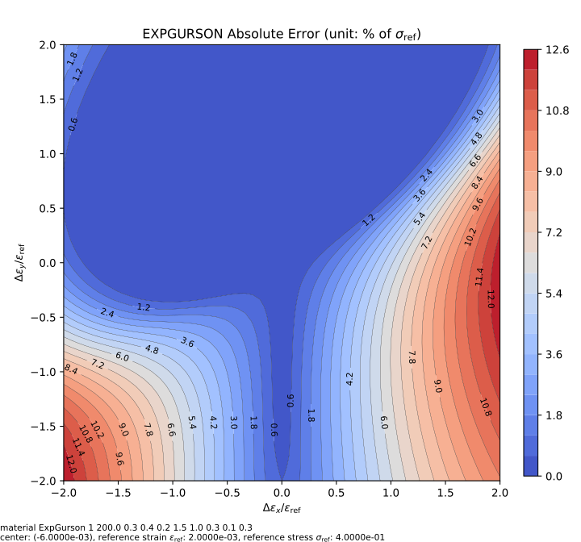

# ExpGurson

See also the corresponding section in [Constitutive Modelling Cookbook](https://github.com/TLCFEM/constitutive-modelling-cookbook/releases/download/latest/COOKBOOK.pdf).

References:

1. [10.1002/nme.1620240713](https://doi.org/10.1002/nme.1620240713)

## Syntax

```
material ExpGurson (1) (2) (3) (4) (5) [6] [7] [8] [9] [10] [11]
# (1) int, unique material tag
# (2) double, elastic modulus
# (3) double, poissons ratio
# (4) double, initial yield stress, \sigma_y^0
# (5) double, n
# [6] double, q1, default: 1.0
# [7] double, q2, default: 1.0
# [8] double, fn, default: 0.0
# [9] double, sn, default: 1.0
# [10] double, en, default: 0.0
# [11] double, density, default: 0.0
```

## Theory

The yield stress is governed by the following implicit function.

$$
\dfrac{\sigma_y}{\sigma_y^0}=\left(\dfrac{\sigma_y}{\sigma_y^0}+\dfrac{3G}{\sigma_y^0}\varepsilon_m^p\right)^n.
$$

Note we are using a slightly different notation compared to the one presented in [10.1002/nme.1620240713](https://doi.org/10.1002/nme.1620240713).

## Remarks

Due to that the yield function has the quadratic term $$q^2$$, it shall be noted that the unit of the model shall be
selected carefully. For example, if the yield stress is $$1000~\mathrm{MPa}$$ and $$\mathrm{Pascal}$$ is used as the
unit for stress, then the input number is $$10^9$$, the square of which is greater than $$10^{16}$$ so that the yield
function likely overflows.

## Iso-error Map

The following example iso-error maps are obtained via the following script.

```py
from plugins import ErrorMap
# note: the dependency `ErrorMap` can be found in the following link
# https://github.com/TLCFEM/suanPan-manual/blob/dev/plugins/scripts/ErrorMap.py

young_modulus = 2e2
yield_stress = 0.4

with ErrorMap(
    f"material ExpGurson 1 {young_modulus} 0.3 {yield_stress} 0.2 1.5 1.0 0.3 0.1 0.3",
    ref_strain=yield_stress / young_modulus,
    ref_stress=yield_stress,
    contour_samples=30,
) as error_map:
    error_map.contour(
        "exp.gurson.uniaxial", center=(-3, 0), size=2, type={"rel", "abs"}
    )
    error_map.contour(
        "exp.gurson.biaxial", center=(-3, -3), size=2, type={"rel", "abs"}
    )
```




