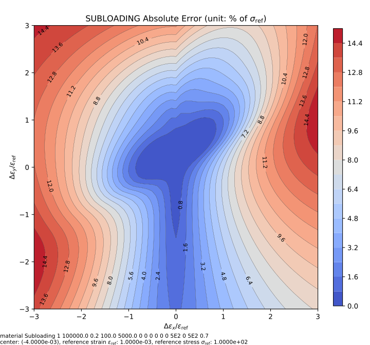

# Subloading

The Modified Extended 3D Subloading Surface (Hashiguchi) Model

The subloading surface framework provides a very versatile approach to model cyclic behaviour.
It is highly recommended to try it out.

## References

The implementation is based on the following paper.

1. [10.1007/s00707-025-04339-0](https://doi.org/10.1007/s00707-025-04339-0)

Additional material on the same topic can be found in the following literature.

1. [10.1007/978-3-030-93138-4](https://doi.org/10.1007/978-3-030-93138-4)
2. [10.1007/s11831-023-10022-1](https://doi.org/10.1007/s11831-023-10022-1)
3. [10.1007/s11831-022-09880-y](https://doi.org/10.1007/s11831-022-09880-y)

Prof. Koichi Hashiguchi has published a large amount of papers on this topic.
To find more references, please refer to the monograph and the references therein.

## Theory

Refer to the corresponding section
in [Constitutive Modelling Cookbook](https://github.com/TLCFEM/constitutive-modelling-cookbook/releases/download/latest/COOKBOOK.pdf)
for theory, formulation and implementation details.

## Syntax

```text
material Subloading (1) (2) (3) (4) (5) (6) (7) (8) (9) (10) (11) (12) (13) (14) (15) [16]
# (1) int, unique material tag
# (2) double, elastic modulus
# (3) double, poisson's ratio
# (4) double, isotropic initial stress, \sigma^i
# (5) double, isotropic linear hardening modulus, k_{iso}
# (6) double, isotropic saturation stress, \sigma^s
# (7) double, isotropic saturation rate, m^s_{iso}
# (8) double, kinematic initial stress, a^i
# (9) double, kinematic linear hardening modulus, k_{kin}
# (10) double, kinematic saturation stress, a^s
# (11) double, kinematic saturation rate, m^s_{kin}
# (12) double, yield ratio evolution rate, u
# (13) double, kinematic hardening rate, b
# (14) double, elastic core evolution rate, c_e
# (15) double, elastic core size, z_e
# [16] double, density, default: 0.0
```

## History Layout

| location                | parameter                                  |
| ----------------------- | ------------------------------------------ |
| `initial_history(0)`    | iteration counter                          |
| `initial_history(1)`    | accumulated plastic strain $$q$$           |
| `initial_history(2)`    | normal yield ratio $$z$$                   |
| `initial_history(3:8)`  | normalised back stress $$\mathbf{\alpha}$$ |
| `initial_history(9:14)` | normalised elastic core $$\mathbf{d}$$     |

## Example

See [this](../../../../Example/Structural/Statics/calibration-subloading.md) example.

## Iso-error Map

The following example iso-error maps are obtained via the following script.

```py
from plugins import ErrorMap
# note: the dependency `ErrorMap` can be found in the following link
# https://github.com/TLCFEM/suanPan-manual/blob/dev/plugins/scripts/ErrorMap.py

young_modulus = 1e5
yield_stress = 100.0
hardening_ratio = 0.05

with ErrorMap(
    f"""material Subloading 1 {young_modulus} 0.2 \
{yield_stress} {hardening_ratio * young_modulus} 0 0 \
0 0 0 0 \
5E2 0 0 0""",
    ref_strain=yield_stress / young_modulus,
    ref_stress=yield_stress,
    contour_samples=20,
) as error_map:
    error_map.contour("subloading.uniaxial", center=(-2, 0), size=1)
    error_map.contour("subloading.biaxial", center=(-2, -2), size=1)
```




The following example iso-error maps are obtained via the following script.

```py
from plugins import ErrorMap
# note: the dependency `ErrorMap` can be found in the following link
# https://github.com/TLCFEM/suanPan-manual/blob/dev/plugins/scripts/ErrorMap.py

young_modulus = 1e5
yield_stress = 100.0
hardening_ratio = 0.05

with ErrorMap(
    f"""material Subloading 1 {young_modulus} 0.2 \
{yield_stress} {hardening_ratio * young_modulus} 0 0 \
0 0 0 0 \
5E2 0 5E2 0.7""",
    ref_strain=yield_stress / young_modulus,
    ref_stress=yield_stress,
    contour_samples=30,
    parallel=7,
) as error_map:
    error_map.contour("subloading.uniaxial", center=(-4, 0), size=3, type="rel")
    error_map.contour("subloading.biaxial", center=(-4, -4), size=3, type="rel")
```


