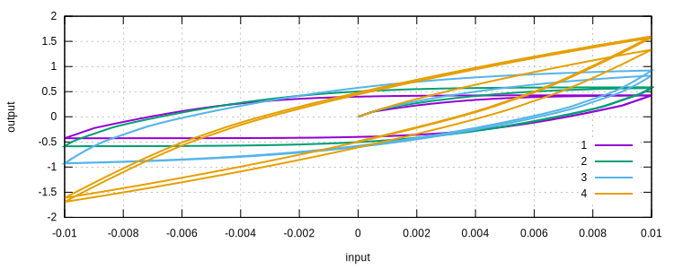
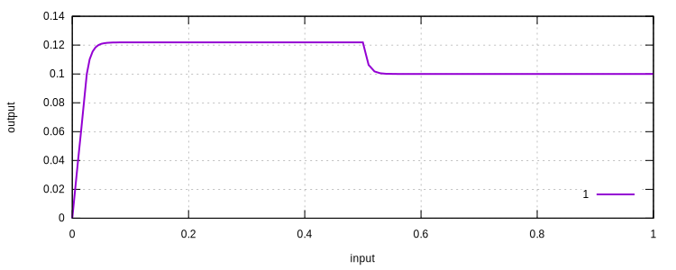

# VAFCRP

Viscous J2 Steel Model

Before I can find a proper name for it, I would call it `VAFCRP` model. Although the name is a bit weird, it contains
all the initials of researchers. Similar models are available as: [`ArmstrongFrederick`](ArmstrongFrederick.md)
, [`ExpJ2`](ExpJ2.md) and [`NonlinearPeric`](NonlinearPeric.md).

## References

1. [https://doi.org/10.1017/S0368393100118759](https://doi.org/10.1017/S0368393100118759)
2. [https://doi.org/10.1179/096034007X207589](https://doi.org/10.1179/096034007X207589)
3. [https://doi.org/10.1016/0749-6419(89)90015-6](https://doi.org/10.1016/0749-6419(89)90015-6)
4. [https://doi.org/10.1002/nme.1620360807](https://doi.org/10.1002/nme.1620360807)

## Theory

The `VAFCRP` model is a von Mises J2 yield criterion based model and uses an associative plasticity flow. The yield
function is defined as

$$
F=\sqrt{\dfrac{3}{2}(s-\beta):(s-\beta)}-k=q-k.
$$

So the plastic flow is

$$
\dot{\varepsilon}^p=\gamma\dfrac{\partial{}F}{\partial{}\sigma}=\sqrt{\dfrac{3}{2}}\gamma{}n,
$$

where $$n=\dfrac{\eta}{|\eta|}=\dfrac{s-\beta}{|s-\beta|}$$.

### V

The Voce (1955) type isotropic hardening equation is used.

$$
k=\sigma_y+k_s(1-e^{-mp})+k_lp,
$$

where $$\sigma_y$$ is the initial elastic limit (yielding stress), $$k_s$$ is the saturated stress, $$k_l$$ is the
linear hardening modulus, $$m$$ is a constant that controls the speed of hardening,
$$\mathrm{d}p=\sqrt{\dfrac{2}{3}\mathrm{d}\varepsilon^p:\mathrm{d}\varepsilon^p}$$ is the rate of accumulated plastic
strain $$p$$.

### AF

The Armstrong-Frederick (1966) kinematic hardening rule is used. The rate form of back stress $$\beta^i$$ is

$$
\mathrm{d}\beta^i=\sqrt{\dfrac{2}{3}}a^i~\mathrm{d}\varepsilon^p-b^i\beta~\mathrm{d}p,
$$

where $$a^i$$ and $$b^i$$ are material constants. Note here a slightly different definition is adopted as in the
original literature $$\dfrac{2}{3}$$ is used instead of $$\sqrt{\dfrac{2}{3}}$$. This is purely for a slightly more tidy
derivation and does not affect anything.

### CR

A multiplicative formulation (Chaboche and Rousselier, 1983) is used for the total back stress.

$$
\beta=\sum\beta^i.
$$

### P

The Peric (1993) type definition is used for viscosity.

$$
\dfrac{\gamma}{\Delta{}t}=\dot{\gamma}=\dfrac{1}{\mu}\left(\left(\dfrac{q}{k}\right)^{\dfrac{1}{\epsilon}}-1\right),
$$

where $$\mu$$ and $$\epsilon$$ are two material constants that controls viscosity.
Note either $$\mu$$ or $$\epsilon$$ can be set to zero to disable rate-dependent response
In that case this model is identical to the [`ArmstrongFrederick`](ArmstrongFrederick.md) model.

Also note the Perzyna type definition, which is defined as

$$
\dfrac{\gamma}{\Delta{}t}=\dot{\gamma}=\dfrac{1}{\mu}\left(\dfrac{q}{k}-1\right)^{\dfrac{1}{\epsilon}},
$$

is **not** used. It shall in fact be avoided as it is less numerically stable than the Peric definition since it is not
known whether $$\dfrac{q}{k}-1$$ is greater or smaller than $$1$$.

## Syntax

The following applies to `v3.6` and later.
Check the older syntax in the older version of the documentation.

```
material VAFCRP (1) (2) (3) (4) (5) (6) (7) (8) (9) [10 11...] [12]
# (1) int, unique material tag
# (2) double, elastic modulus
# (3) double, poissons ratio
# (4) double, yield stress
# (5) double, linear hardening modulus
# (6) double, saturation stress
# (7) double, m, saturation rate
# (8) double, mu
# (9) double, epsilon
# (10) double, a, kinematic hardening parameter
# (11) double, b, kinematic hardening parameter
# [12] double, density, default: 0.0
```

## Example

This model is essentially a viscous extension of the [`ArmstrongFrederick`](ArmstrongFrederick.md) model. Only some
different behaviour is shown here.

### Viscosity

For static analysis with viscosity material, the step time is not analytical time any more, it represents real time as it
is used in the computation of viscous response. The step time shall be properly set to be consistent with the material
parameters used in the model.

```
material VAFCRP 1 2E2 .2 .1 0. 0. 0. 1. 0. 50. 500. 100. 600.
material VAFCRP 2 2E2 .2 .1 0. 0. 0. 1. 10. 50. 500. 100. 600.
material VAFCRP 3 2E2 .2 .1 0. 0. 0. 1. 20. 50. 500. 100. 600.
material VAFCRP 4 2E2 .2 .1 0. 0. 0. 1. 50. 50. 500. 100. 600.
```



### Relaxation

```
material VAFCRP 1 2E2 .2 .1 0. 0. 0. 1. 10.
```


