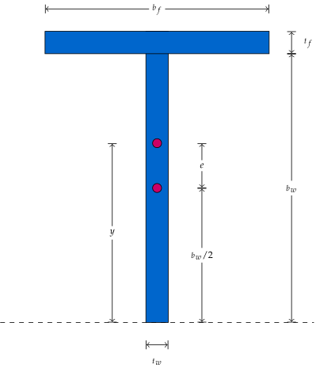

# Eccentricity

This page discusses the eccentricity of a section.

Consider the following T-section with $$b_f=7.04$$, $$t_f=0.59$$, $$b_w=11.31$$ and $$t_w=0.43$$.
It is `WT12X31` section in the [AISC](https://www.aisc.org/globalassets/aisc/manual/v15.0-shapes-database/aisc-shapes-database-v15.0.xlsx) table.



The first moment of area can be computed as

$$
\begin{split}
y=&\dfrac{b_wt_w(b_w/2)+b_ft_f(b_w+t_f/2)}{b_wt_w+b_ft_f}\\
=&\dfrac{11.31^2\times0.43/2+7.04\times0.59\times(11.31+0.59/2)}{11.31\times0.43+7.04\times0.59}\\
=&8.3958
\end{split}
$$

The eccentricity is then the difference between the centroid and the first moment of area.

$$
e=8.3958-11.31/2=2.7408.
$$

Or simply,

$$
e=\dfrac{7.04\times0.59\times(11.31/2+0.59/2)}{11.31\times0.43+7.04\times0.59}\\
=2.7408.
$$

If the default trivial eccentricity is used, then axial loading will lead to transverse displacement. See the following example.

```text
node 1 0 0
node 2 1 0
material Elastic1D 1 1
section US2D WT12X31 1 1 1 10 0
element B21 1 1 2 1
fix2 1 E 1
displacement 1 0 1 1 2
step static 1
set ini_step_size 1
analyze
# Node 2:
# Coordinate:
#   1.0000e+00  0.0000e+00
# Displacement:
#   1.0000e+00 -6.2092e-02 -1.2418e-01
# Resistance:
#   5.9478e+00 -1.3410e-14 -1.7171e-14
peek node 2
exit
```

Manually set the eccentricity removes the extra bending.

```text
node 1 0 0
node 2 1 0
material Elastic1D 1 1
section US2D WT12X31 1 1 1 10 2.740844414
element B21 1 1 2 1
fix2 1 E 1
displacement 1 0 1 1 2
step static 1
set ini_step_size 1
analyze
# Node 2:
# Coordinate:
#   1.0000e+00  0.0000e+00
# Displacement:
#   1.0000e+00 -1.2963e-11 -2.5926e-11
# Resistance:
#   9.0169e+00 -1.9722e-31  8.8818e-16
peek node 2
exit
```

The axial rigidity matches the theoretical value with area being $$A=11.31\times0.43+7.04\times0.59=9.0169$$.

The flexural rigidity can be obtained by applying a transverse loading.

```text
node 1 0 0
node 2 1 0
material Elastic1D 1 1
section US2D WT12X31 1 1 1 10 2.740844414
element B21 1 1 2 1
fix2 1 E 1
displacement 1 0 1 2 2
step static 1
set ini_step_size 1
analyze
# Node 2:
# Coordinate:
#   1.0000e+00  0.0000e+00
# Displacement:
#  -5.6617e-10  1.0000e+00  1.5000e+00
# Resistance:
#  -1.5586e-15  3.9382e+02 -7.1057e-15
peek node 2
exit
```

From the [AISC](https://www.aisc.org/globalassets/aisc/manual/v15.0-shapes-database/aisc-shapes-database-v15.0.xlsx) table, the moment of inertia is $$I=131$$, then $$3EI=393\approx393.82$$.

This manual adjustment of eccentricity exists since it is beneficial when it comes to creating complex sections of basic shapes.

But when analysing simple sections alone, it is desired to place the section at its barycenter.
This is not a problem for symmetric sections, but for asymmetric sections, the default eccentricity would cause unwanted results.

There are `US2DC` and `US3DC` available,
which automatically adjust the eccentricity so that all forces are applied at the barycenter.
