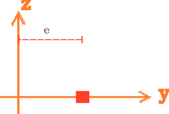

# Bar2D

2D Reinforcing Bar Section



## Syntax

```
section Bar2D (1) (2) (3) [4]
# (1) int, unique section tag
# (2) double, area
# (3) int, material tag
# [4] double, eccentricity/location, default: 0.0
```
