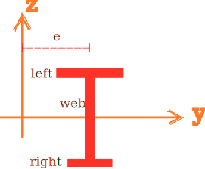

# HSection2D

2D H-Section



## Syntax

```
section HSection2D (1) (2...7) (8) [9] [10]
# (1) int, unique tag
# (2...7) double, section dimensions
# (8) int, material tag
# [9] int, number of integration points for flanges, default: 6
# [10] double, eccentricity/location, default: 0.0
```

## Remarks

1. Section dimensions are:
   * `(2)` left flange height
   * `(3)` left flange thickness
   * `(4)` right flange height
   * `(5)` right flange thickness
   * `(6)` web width
   * `(7)` web thickness

Two integration points are used for web.
The user assigned number of integration points is used for flanges.

The eccentricity is measured from the centre of the web/flanges.
If the left and right flanges have different sizes, the default trivial eccentricity will lead to extra bending moments
when the section is subjected to axial force.
Eccentricity can be manually adjusted.

See [Eccentricity](../Eccentricity.md) for more details.
