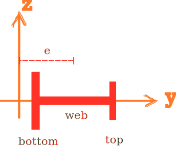

# ISection2D

2D I-Section



## Syntax

```
section ISection2D (1) (2...7) (8) [9] [10]
# (1) int, unique tag
# (2...7) double, section dimensions
# (8) int, material tag
# [9] int, number of integration points for web, default: 6
# [10] double, eccentricity/location, default: 0.0
```

## Remarks

1. Section dimensions are:
   * `(2)` top flange width
   * `(3)` top flange thickness
   * `(4)` bottom flange width
   * `(5)` bottom flange thickness
   * `(6)` web height
   * `(7)` web thickness

Two integration points are used for both flanges.
The user assigned number of integration points is used for web.

The eccentricity is measured from the centre of the web.
If the top and bottom flanges have different sizes, the default trivial eccentricity will lead to extra bending moments
when the section is subjected to axial force.
Eccentricity can be manually adjusted.

See [Eccentricity](../Eccentricity.md) for more details.
