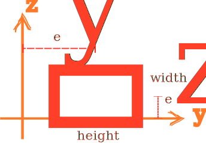

# Box3D

3D Box Section



## Syntax

```
section Box3D (1) (2) (3) (4) (5) [6] [7] [8]
# (1) int, unique section tag
# (2) double, width
# (3) double, height
# (4) double, thickness
# (5) int, material tag
# [6] int, number of integration points, default: 6
# [7] double, eccentricity along y axis, default: 0.0
# [8] double, eccentricity along z axis, default: 0.0
```

## Remarks

The eccentricity is measured from the centre of the section.

The width and height are measured from midline to midline.
