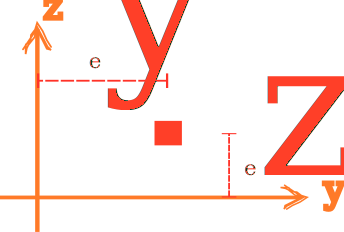

# Cell3D

3D Cell Section



## Syntax

```
section Cell3D (1) (2) (3) [4] [5]
# (1) int, unique section tag
# (2) double, area
# (3) int, material tag
# [4] double, eccentricity along y axis, default: 0.0
# [5] double, eccentricity along z axis, default: 0.0
```
