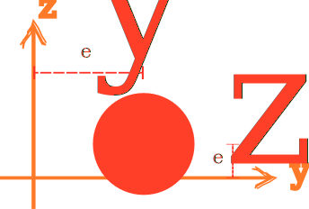

# Circle3D

3D Circle Section



## Syntax

```
section Circle3D (1) (2) (3) [4] [5] [6]
# (1) int, unique section tag
# (2) double, radius
# (3) int, material tag
# [4] int, number of integration points, default: 6
# [5] double, eccentricity along y axis, default: 0.0
# [6] double, eccentricity along z axis, default: 0.0
```

The 2D integration scheme is applied to the whole circle under the polar coordinate system.
