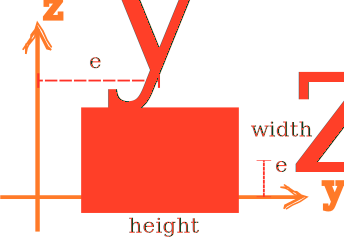

# Rectangle3D

3D Rectangle Section



## Syntax

```
section Rectangle3D (1) (2) (3) (4) [5] [6] [7]
# (1) int, unique section tag
# (2) double, section width
# (3) double, section height
# (4) int, material tag
# [5] int, number of integration points, default: 6
# [6] double, eccentricity along y axis, default: 0.0
# [7] double, eccentricity along z axis, default: 0.0
```
